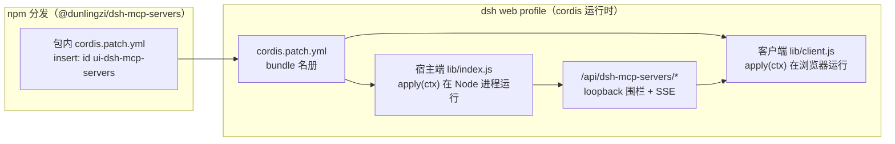

# dsh-mcp-servers 插件架构文档

> 本目录用**图解为主**的方式，讲清本插件的**结构、原理、边界与演进**。
> 图使用两种载体（源数据均归档、可复现）：
> - **SVG 架构图**：按 diagram-design 编辑风手写 SVG，源文件归档在 `diagrams/`；
> - **Mermaid 图**：内嵌在 md 中，GitHub 原生渲染，源码即文档（天然可维护）。
>
> 仓库级共享机制（loopback 围栏、官方 settings 存储、client 干净模块等）见
> [「通用机制」](#通用机制)。

## 文档索引

| 文档 | 回答什么问题 | 什么时候读 |
|---|---|---|
| [dsh-mcp-servers.md](dsh-mcp-servers.md) | **怎么跑**：双轨模型面、插件装配、服务器生命周期、中间层链路、传输与安全模型、路由与已知限制 | 想搞懂运行机制 / 排查行为时先读这份 |
| [dsh-mcp-servers-structure-review.md](dsh-mcp-servers-structure-review.md) | **长什么样、哪里薄、往哪走**：仓库 / 包 / 域三级结构实测、六载体落地、对照方法论的评估、结构级风险、分阶段演进路线 | 动结构、做重构、评估技术债时先读这份 |

两篇之外的依据：仓库硬性规则见 [AGENTS.md](../../AGENTS.md)，开发与构建契约见
[docs/DEVELOPMENT.md](../DEVELOPMENT.md)，架构治理方法论（评估尺子）见
[docs/ARCHITECTURE-METHOD.md](../ARCHITECTURE-METHOD.md)。

## 全景：插件如何挂载进 dsh web

本插件不修改 DSH 源码——统一经 **`cordis.patch.yml` + profile 机制**挂载：

要点：

- **安装**：`dsh plugin --profile web add @dunlingzi/dsh-mcp-servers` → 包内
  `cordis.patch.yml` 的 insert 行被写进 profile 插件名册；`dsh web` 重启时组合 bundle，
  宿主端与客户端各跑一半；
- **宿主端**（`exports "."` → `lib/index.js`）：在 Node 进程中 `apply(ctx)`，注入
  `webServer` / `tools` / `settings` / `agent` 等官方服务，注册路由、工具与事件监听；
- **客户端**（`exports "./client"` → `lib/client.js`）：干净模块（`apply(ctx)` +
  `inject`），构建期内联样式与依赖；
- **与 `@wingsky-1/dsh-mcp-manager` 互斥安装**（共享 `<DSH_HOME>/dsh-mcp.json` 与
  `ws_mcp_*` / `mcp__` 工具面，同装会双注册冲突）。

## 通用机制

本插件遵循仓库级共享约定（单一事实源在 `shared/` 与 [docs/DEVELOPMENT.md](../DEVELOPMENT.md)）：

| 机制 | 说明 | 实现位置 |
|---|---|---|
| **loopback 围栏** | 所有 `/api` 路由强制回环来源（remoteAddress + Host + 非跨站 + Origin 同源），非法 403 / 方法错 405——DNS 重绑定与跨站防御 | `shared/loopback.js`（`isLoopbackRequest`） |
| **官方 settings 存储** | 插件配置走 dsh 官方 `settings.register` 命名空间，组合层 cordis config 作 base 层，热更新由 `scope.watch` 驱动 | `shared/settings-namespace.js`（`installSettingsNamespace`） |
| **客户端干净模块** | 只 `export function apply(ctx)` + `export const inject`；样式独立 `src/client/style.css`；构建期内联（`scripts/build/build-client.ts`） | `packages/dsh-mcp-servers/src/client/index.ts` |
| **发布物自包含** | 第三方依赖构建期内联进 `lib/`，运行时零 npm 依赖；license 自动归集 `lib/THIRD-PARTY-LICENSES` | `scripts/build/` |
| **宿主 / 客户端契约** | 宿主端在组合根透出纯函数与常量，smoke 从产物导入断言（路由围栏 + 客户端契约） | `packages/dsh-mcp-servers/test/` |

> settings 的**落盘位置**当前两说并存（`shared/README.md` 写 `<DSH_HOME>/settings.yaml`，
> 全局 `~/.dsh/AGENTS.md` 说该文件自 rc.2 起被启动消费改名）——动手前先实测，
> 裁决记录见 [structure-review §10](dsh-mcp-servers-structure-review.md#10-未核实)。

## 图源

| 文档 | 图 | 源文件 |
|---|---|---|
| [dsh-mcp-servers.md](dsh-mcp-servers.md) | 双轨架构图 | `diagrams/mcp-servers-architecture.html` |
| 各文档内的流程 / 时序 / 状态图 | 内嵌 mermaid | 源码即文档（改 md 即可） |
