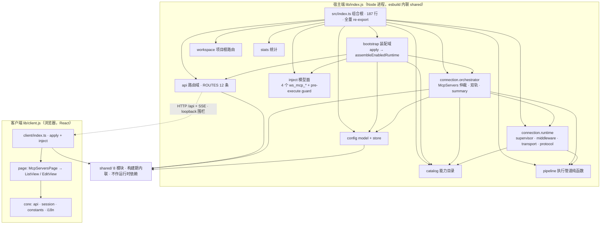
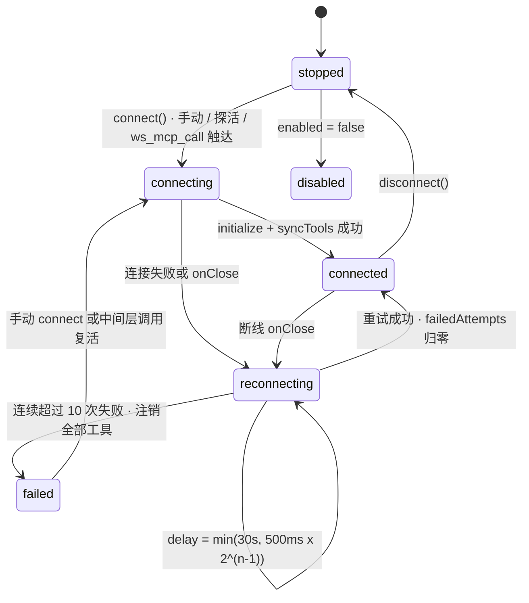
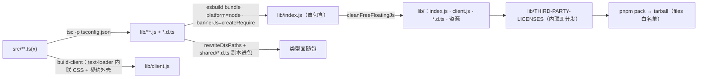

# dsh-mcp-servers 结构梳理与架构评估

> 包：`@dunlingzi/dsh-mcp-servers` · 源码：`packages/dsh-mcp-servers/` · 版本：以
> [package.json](../../packages/dsh-mcp-servers/package.json) 为准（本文件刻意不复制版本号）。
>
> **本文件定位**：as-is **结构盘点**（仓库 / 包 / 域三级 + 依赖方向与载体落地实测）、
> **架构评估**（以 [架构治理方法论](../ARCHITECTURE-METHOD.md) 为尺子）、
> **演进路线**（分阶段、可独立回滚）。运行机制（双轨模型面、状态机、中间层链路、
> 安全模型）的图解主文档是 [dsh-mcp-servers.md](dsh-mcp-servers.md)——两者分工：
> 那份讲「怎么跑」，本文件讲「长什么样、哪里薄、往哪走」。

<a id="0-证据口径"></a>
## 0. 证据口径与基线

按方法论 §10 的「存量数字四要素」记账，缺一不可：

| 要素 | 取值 |
|---|---|
| commit | `0da41cf`（本文件落盘时的 `main` 顶点；工作分支 `task/p0-peer-range-gate`） |
| 脚本 | 域级计数与行数由 `Get-ChildItem -Recurse` + 逐文件 `0x0A` 计数得出；门禁结论由 §9.1 列出的真实命令得出 |
| 粒度 | `packages/dsh-mcp-servers/src/**`（递归，含 `.ts`/`.tsx`/`.css`/`.d.ts`）；shared 为仓库根 `shared/**` |
| 计数单位 | 「文件数」= 递归文件个数；「行数」= `0x0A` 切分计数（非 `Measure-Object -Line`，两者口径不同，本仓库历史上因此差过 49 行） |

运行环境：Node `v24.21.0`（仓库自带运行时；PATH 上的 `v22.22.0` **不满足**本仓库
`engines: node >= 23.6` 的 TS 直跑门槛）。

凡未实际运行的判定，本文一律标注「未运行」，不写成结论。

**门禁实测（2026-10-02，工作分支）**：`pnpm gate:pr` **13/13 步 `exit=0`**——build、test、typecheck、
contract、pack:check、verify:npmlayout、stryker:check、test:src-tests、gate:homedir、docs:check、
lint、前置包 build、test:scripts。其中 `pnpm test` = **16 文件 / 1085 用例全绿**；
`test:scripts` = **341 用例（335 通过 / 6 因宿主不可达跳过 / 0 失败）**；
`lint` = 170 文件 error 0；`contract` 的 catalog-peers 段 = `catalog 15 键 | 官方 peer 5 处（区间豁免 5）` PASS。

<a id="1-仓库结构"></a>
## 1. 仓库结构

| 路径 | 内容 | 一句话 |
|---|---|---|
| `packages/dsh-mcp-servers/` | 唯一功能包（src 73 文件 / 9359 行） | 单插件仓库的唯一发布物 |
| `shared/` | 8 个 `.js` + `.d.ts` 双写模块（6 宿主 + 2 客户端）+ 1 个纯声明 | 构建期 esbuild 内联，不单独发布 |
| `scripts/` | `build` `ci` `data` `gate` `lib` `maintenance` `release` `test` | 构建链 + 门禁 + 脚本自测 |
| `tools/lint/` | 隔离的 ESLint 工具链（读取 `gauntlet.config.json` 的复杂度阈值） | 与根 tsgo 7.x 无 compiler API 的冲突隔离 |
| `test/` | `smoke-lib.ts` 等夹具 | 跨包契约夹具，不是测试条目 |
| `agents/` + `.dsh/skills/` | 角色规程 / 项目级 skill | 自治维护循环用 |
| `stryker.conf.d/`（6）+ `vitest.stryker.d/` | 变异六段配置 + 派生的变异面测试清单 | 段名按功能域：entry / manager / middleware / routes / runtime / supervisor |
| `.github/workflows/`（6） | `ci` `observe` `observe-incremental` `release` `baseline-overlay` `health-report` | PR 增量 + 夜间全量 + tag 发布 |

<a id="2-包级结构"></a>
## 2. 包级结构

- **双入口**：`exports["."]` → `lib/index.js`（宿主端，Node 进程内 `apply(ctx)`）；
  `exports["./client"]` → `lib/client.js`（浏览器干净模块）。types 分别指
  `lib/index.d.ts` / `lib/client/index.d.ts`。
- **挂载契约**：`dsh.bundle.patch` 指 `cordis.patch.yml`（patch id `ui-dsh-mcp-servers`，
  符合「patch id 用 `ui-<name>`」约定）；`bannerJs` 注入 `createRequire` 供内联 CJS 使用。
- **发布物白名单**：`lib` + `shared/**/*.d.ts` + patch + README + LICENSE；零运行时依赖，
  第三方全部构建期内联，license 经构建链归集到 `lib/THIRD-PARTY-LICENSES`，
  `pnpm pack:check` 断言覆盖。
- **测试面**：16 个 `*.test.ts`（unit 14 / integration 1 / e2e 1；`test/client` 目录为空），
  与包内 `--min 16` 一致；`pnpm stryker:check` 强制两者同步。

<a id="3-域级结构"></a>
## 3. src 域级结构（实测）

| 域 | 文件 | 行数 | 职责 | 关键实现 |
|---|---|---|---|---|
| `bootstrap` | 6 | 612 | 组合根装配：配置解析、服务注入、运行期装配、宣告文案 | `apply.ts`、`apply-runtime.ts` |
| `api` | 4 | 626 | HTTP 路由装配 + 控制器工厂 + SSE / health | `routes-controllers.ts`、`routes.ts` |
| `inject` | 2 | 738 | 模型面 4 个 `ws_mcp_*` 工具 + pre-execute guard | `middleware-register.ts`（730 行） |
| `connection` | 11 | 2771 | 连接仲裁与双轨（orchestrator）+ 监督器 / 中间层池 / 传输 / 协议（runtime） | `manager.ts`（1113 行）、`middleware.ts`（694）、`supervisor.ts`（527） |
| `catalog` | 7 | 1045 | 能力目录：条目渲染、digest、会话内历史定位、检索族 | `entries.ts`（384）、`search.ts`（344） |
| `pipeline` | 7 | 379 | 两条执行路径共用的纯函数：参数归一 / 脱敏 / 超时 / 授权 / 结果投影 | `authorize.ts`、`project.ts` |
| `config` | 7 | 484 | model（schema / 导入 / 归一）+ store（持久化 / 用户态 / 目录缓存 IO） | `middleware-state.ts`、`store.ts` |
| `client` | 12 | 1675 | 浏览器端：设置页注册、会话跟随、SSE、列表/编辑页、双语字典、独立 CSS | `ListView.tsx`、`EditView.tsx`、`style.css`（454） |
| `workspace` | 6 | 173 | 项目根发现、服务器全名解析、scope、中间层模式归一 | `root-resolution.ts`、`full-name.ts` |
| `types` | 5 | 309 | 跨域 type-only DTO 与宿主最小依赖面 | `middleware-types.ts`、`host-faces.ts` |
| `stats` | 3 | 317 | 调用统计与渐进披露漏斗（metadata-only、原子落盘） | `collector.ts` |
| `integration` | 2 | 43 | `ctx.mcpServers` 服务类型面 + cordis 声明合并 | `service.ts` |
| `index.ts` | 1 | 187 | 组合根：装配 + 全量 re-export | `index.ts` |
| **合计** | **73** | **9359** | | |

<a id="4-六载体落地"></a>
## 4. 六载体落地实测（方法论 §2 的尺子）

| 载体 | 方法论要求 | 本仓库实测 |
|---|---|---|
| `<域>/interface.ts` | 域入口，跨域只经它 | **14/14 域齐备**（叶子粒度：13 个域 + `connection` 下 2 个子域） |
| `<域>/deps.ts` | 域出口，声明对上依赖的注入面 | **0 个（载体不存在）** |
| `<域>/<impl>.ts` | 本域实现，白盒单测直连 | 齐备 |
| `types/` | 多模块共用类型（type-only） | 5 文件，全部 type-only |
| `utils/` | 多模块共用函数与常量 | 不存在（共用纯函数归 `pipeline` 域，符合 §3 准入判据 1「有领域所有者就留原域」） |
| `index.ts` | 组合根：装配 + 包导出面 | 187 行、24 条 re-export |

`deps.ts` 为零不是「少个文件」，而是结构性后果：门禁中依赖它的两条判据
（意图图对照的**死声明**检测、`deps.ts` 值导入硬判红）在本仓库**恒为空转**——
方法论 §7 要求的「事实图 × 意图图」对照只有事实图一侧。

<a id="5-架构设计"></a>
## 5. 架构设计（as-is）

### 5.1 分层与依赖方向



### 5.2 运行时装配（`apply(ctx)` 顺序）

`src/bootstrap/apply.ts`：解析配置 → `McpStore` 加载（mtime 基线）→ `new McpServers(ctx, store)`
→ `provide('mcpServers')` + settings 命名空间与 `uiUpdate` sink → 统计接线 →
若 `enabled=false` 则**不注册任何路由 / 工具 / 提示词**（服务本身仍提供）→ 否则
`resolveMiddlewareMode` → 先建中间层（`initMiddleware` 早于 `startAll`，规避「先建后停」竞态）
→ 注册 4 个 `ws_mcp_*` 与 guard → `startAll()` → `loadCatalogCache()` → `reconcileServers()`
→ 热切换闭包 → 能力目录注入钩子 → 注册路由与 SSE → 配置目录 `fs.watch` →
`systemPrompt.section` 宣告 → `ctx.effect` 统一 dispose。

### 5.3 模型面双轨

判定口径唯一：`middlewareTakes(name, scope)`。`off` → 全部直呼
（`mcp__<server>__<tool>`）；`scope === project` → 中间层接管（project 与 all 模式皆然）；
`all && scope === global` → 接管（含 runtime 注入条目）。收敛点是 `reconcileServers()`：
以「全局 store ∪ 项目 store ∪ runtime 注入」求差集，变化才动作。

### 5.4 服务器生命周期（六态 + 有界退避）



状态全集 `connected / connecting / reconnecting / stopped / disabled / failed`，
由 `summarize` 投影；客户端侧另有一份 `STATUS_ORDER` / `STATUS_TEXT` / `STATUS_BUCKETS`
（六态收四簇）——**同一张表的第二个副本**，见 §7.2。

### 5.5 中间层：连接池、按会话 cwd 路由、一次 `ws_mcp_call`

- 连接池以 `units: Map<root, ProjectUnit>` 按项目根分单元（LRU ≤16，`@global` 豁免）；
  `ws_mcp_call` 执行时按**调用方会话 cwd** 选根，并用 server 全名 `@<root>/<s>`
  做一致性校验防跨空间串台。
- **只读边界**：`ws_mcp_list` / `ws_mcp_detail` / `ws_mcp_search` 只读本地目录缓存，
  不触达远端、不过策略 guard；`ws_mcp_call` 是唯一执行远端且受 `middlewarePolicy`
  约束的入口（deny 优先）。
- 工具级禁用三入口一致裁决（`callTool` / pre-execute guard / 裸名声明），
  `off` 模式的直呼 guard 另有独立实现。

### 5.6 传输层与安全模型

- **stdio**：包官方 `StdioClientTransport`；子进程 env 先剔除
  `(KEY|TOKEN|SECRET|PASSWORD|PASSWD|CREDENTIAL|AUTH)` 形状变量与 `DSH_*` 前缀，
  再合并显式 env（`${ENV}` 展开）；保留 `stderrTail` 供启动失败诊断。
- **streamable-http**：官方 `StreamableHTTPClientTransport`，headers 支持 `${ENV}`。
- **协议薄适配**：`listTools` / `callTool` 走 `Protocol.request` + 宽松 ResultSchema，
  绕开 SDK 的 outputSchema 强校验；输出 schema 只收严格子集，不进子集即整体回退
  自由 JsonValue（不剥键）。
- **redactor**：收集 env 值、args 中的凭据标志值、headers、URL 与查询参数，
  raw + percent-encoded 双形态注册后逐值替换。
- **围栏与落盘**：全部路由 `guardLoopbackMethod`（403 先于 405），唯一例外是
  GET `/config` 只读豁免；body 限长 2MB；服务器配置 0600 + 原子写。
- **落盘权限的实测口径**：全 `src` 只有 `config/store/store.ts:66` 的 `McpStore.save` 显式写
  `mode: 0o600`（grep `mode:\s*0o600` 单命中）；用户态 / 禁用表 / 目录缓存 / 统计的落盘**未设
  mode**，沿进程 umask 默认。安全模型若被读成「全部落盘面都是 0600」则不准确。

### 5.7 配置与存储

服务器配置三级：全局 `<DSH_HOME>/dsh-mcp.json`、项目级 `<项目根>/.dsh/mcp.json`
（随仓库走）、runtime 注入（内存态，可带封装好的 `toolDefinitions`）；
用户禁用态与工具级禁用合并写 `<DSH_HOME>/dsh-mcp-user-state.json`；
能力目录 last-good 落在 `<DSH_HOME>/dsh-mcp-catalog/<hash>.json`。
插件自身配置走官方 settings 命名空间 + 组合层 config 作 base。

路由表**不在本文件复制**——单一事实源是 `packages/dsh-mcp-servers/README.md` 的路由表
（已核对与源码 `ROUTES` 的 12 条一致），复制一份就是给文档漂移再开一个口子。

### 5.8 构建与发布链



`clean-lib → tsc → bundle-host` 三步；`pnpm pack:check` 断言 exports.types 可解析、
cordis 声明合并可达、shared 声明**查缺 + 查多**、产物无 `../../shared` 残留、
license 覆盖每个被内联的包。

<a id="6-文档体系"></a>
## 6. 文档体系与口径冲突

| 文档 | 定位 | 与实现 / 彼此的口径问题（均已复核） |
|---|---|---|
| [AGENTS.md](../../AGENTS.md) | 硬性红线、权威顺序、门禁分层矩阵 | 门禁矩阵与 `local-gate` / `ci.yml` 一致 |
| [docs/architecture/dsh-mcp-servers.md](dsh-mcp-servers.md) | 面向读者的图解架构 | 本文件同批修正三处：版本号、`apply` 路径、路由表缺项 |
| 本文件 | 结构盘点 + 评估 + 演进路线 | — |
| [docs/ARCHITECTURE-METHOD.md](../ARCHITECTURE-METHOD.md) | 架构治理方法论（本次的尺子） | 其六载体中 `deps.ts` 在本仓库为 0（§4） |
| [docs/DEVELOPMENT.md](../DEVELOPMENT.md) | 宿主 / 客户端开发规范 | 约半数段落描述**已退役机制**：`scripts/gate/aggregate.ts`、`export-surface-snapshot.mjs`、`scripts/lib/export-faces-lib.ts`、`scripts/gate/cov.mjs`、`consumer-types.test.ts`、`packages/dsh-plugins-all/`、`docs/release-notes/` 当前**均不存在**（逐条 glob 已确认） |
| [docs/architecture/README.md](README.md) | 插件架构索引 | 原为 hub 残留（索引 7 个插件中 6 个不在本仓库），本文件同批收口 |
| [shared/README.md](../../shared/README.md) | 共享层模块表 + 准入 1-7 | 双向过期：登记了不存在的 `placement-math.js`、漏登真实在用的 `sse-hub.js`；`frontmatter` 已自陈生产消费退役却仍随包发布（准入 7 的两步走未走完）。**P5 已修正**：删幽灵条目、登记 `sse-hub.js`（含行为契约）、`frontmatter` 标 DEPRECATED 并走两步走第一步、补单插件仓库的消费方说明 |
| [packages/dsh-mcp-servers/README.md](../../packages/dsh-mcp-servers/README.md) / [README.en.md](../../packages/dsh-mcp-servers/README.en.md) | 用户向：安装 / 配置 / 路由表 / 安全模型 | 路由表与源码一致（最贴近实现的一份）；:175-176 的测试组织描述曾是退役口径（「单元测试 `import \"../../lib/index.js\"`」「stryker 经 lib→src hook」）——**P5 已改写为现行口径**（三层目录 + 直连 `src/` + `--min 16` + 拓扑派生链路）。**复核修正**：两语 README 的「0.1.7-rc.1 起」指的是**宿主 dsh 版本**（README.en.md 原文为 `(dsh 0.1.7-rc.1)`），与包版本号无关，**不是**口径冲突 |
| `packages/dsh-mcp-servers/docs/`（5 篇） | 内部治理：架构契约 / v3 主方案 / 对抗性评审 / 阶段 0 规格 / TDD 计划 | 与「内部治理文档不入库」的 non-goals 冲突；引用的变异基线数字已被 `gauntlet.config.json` 的当值取代 |

**根因**：`verify-docs` 的机器判据只覆盖「相对链接存在、锚点可解析、`pnpm <script>` 存在」，
**没有任何数字类判据**（版本号、工具数、路由数、基线值），所以「0.2.0」「恒定两个工具」
这类数字可以长期错下去。改进属于 §9.2 的 P5。

<a id="7-架构评估"></a>
## 7. 架构评估（对照方法论）

### 7.1 六维评估

| 维度 | 尺子 | 实测结论 |
|---|---|---|
| 边界先于结构 | §1-2 | **做得好**：14 个叶子模块 + 齐备 `interface.ts` 门面 + 单调基线 + 「存量经基线豁免、增量收紧」。例外见下条 |
| 域间取值回边 | §2 铁律「impl 引本域门面不得取值」 | **实测（P2 后）**：叶子模块 14 个、值边 33 条、**模块级值环 3 个 / 文件级值环 1 个**（P2 前为 4 / 4）。3 处门面取值回边已清零——`RECONNECT_DEFAULTS` / `resolveReconnect` 本就在同目录 `runtime/reconnect.ts`、`stripMcpPrefix` 在同目录 `orchestrator/tool-names.ts`，改直连后环消失且**公开面零 diff**；剩余 1 个是 `config:model ↔ connection` 的跨域值边（`normalize.ts` 取连接域默认值），需独立决策。另有一条「门面直取他域实现文件」是为规避 TDZ 的不得已特例（`directImpl = 1`，R-A 语义切换后 impl 直引他域实现文件为 0） |
| 共享层准入 | §3-4 | 包内 `types/` 精简且 type-only、无 `utils/`，符合正向预期；`shared/` 层三处登记失守（见 §6） |
| 开闭原则 | §5「新增一项超过 3 处即违反」 | **四个维度全部超标**，见 §7.2 |
| 测试三层与导入面 | §8 导入面矩阵 | 目录齐备（unit / integration / e2e；client 层为空），但 unit 层多数经组合根导入而非白盒直连域内实现；integration 层是**源码文本扫描**而非接缝契约；`interface` 体锚缺失 |
| 「未被机器强制的约束等于不存在」 | §1 第 4 条 | **导出面证据已退役**：`contract-check.ts` 明示 `export-surface-snapshot` 闸已随 dsh-notifier 退役，「导出面 ⊆ 安装面 ∪ 配置面 ∪ 契约面」与「零行为变更由快照证明」两条在本仓库**无机器判据**——187 行组合根、约 138 个导出名既无分类也无快照 |

### 7.2 开闭原则量化（新增一项要改几处）

| 扩展维度 | 必改处（计数口径：必须修改的表或分支，不按关键字行数） | 计数 |
|---|---|---|
| 新增 1 个中间层内置工具 | 工具工厂 + 注册数组 + `MCP_GUIDANCE` + 目录引导文案 + smoke 的四元精确断言 + 包 README + README.en + 架构文档 | **7** |
| 新增 1 条路由 | `ROUTES` + 控制器工厂 + 装配数组 + 客户端路径常量表 + 调用点 + smoke 的 403/405 围栏用例 + 包 README 路由表 + 架构文档路由表 | **8** |
| 新增 1 个配置键 | 配置 schema + 解析 + 默认值常量（跨域 import 边）+ 使用点 + README 配置表 + 测试断言 | **至少 5** |
| 新增 1 个服务器状态 | 宿主 `summarize` + 客户端 `STATUS_ORDER` + `STATUS_TEXT` + `STATUS_BUCKETS` + 双语字典 + 架构文档「六态」描述 | **6** |

对照 §5 的目标形态「单点注册 + 派生，且跨端共用同一张表」：路由表与状态表都是
**宿主 / 客户端各手写一份**，靠 e2e 读产物的字符串比对兜底；工具面文案散在 3 处源码
字符串 + 3 处文档。**四个维度都违反 §5**，这是当前迭代的主要摩擦源。

<a id="8-结构级风险"></a>
## 8. 结构级风险

| 风险 | 等级 | 证据与影响 |
|---|---|---|
| 超大文件与职责堆叠 | 高 | `manager.ts` 1113 行单类承担仲裁 / 双轨 / 池触达 / 持久化 / 探活 / SSE 出口 / 服务方法面；`middleware-register.ts` 730 行含 4 个工具的定义 + 渲染 + 执行 + guard。复杂度阈值取**全域存量最大值**（`gauntlet.config.json` 的 cyclomatic 78 / cognitive 84，target 10/15 只记录不强制）→ 门禁语义是「只拦新增劣化」，往这两个文件里加职责永远不会红。`pnpm cov` 实测更直接：`inject/middleware-register.ts` 是全包覆盖最低文件（**17.53% stmts / 8.05% branch**），职责最重处恰是度量最薄处 |
| 双轨判据互相否定 | 高（已处置） | 见 §9.1：宿主要求 peer 覆盖当前 runtime，仓库门禁要求 peer 写 `catalog:`，而 `catalog:` 在 pack 时被替换为单一精确版本。P0 前 `catalog-peers` 对真实仓库判红，`pnpm contract` 会 `failed++`，`release.yml` 的 contract 段会阻断 tag 发布 |
| 客户端度量盲区 | 中 | 覆盖率分母排除 `**/client/**`（`vitest.config.ts:62`，实测报告中确无 client 行），`test/client` 目录为空；客户端 1675 行（含 454 行 CSS）的唯一机器保证是 e2e 读产物的字符串比对。**附带漂移已修正（P5）**：排除项理由注释（`vitest.config.ts:59`）原按 hub 时代「33 个文件、755 个函数」记账，已改成本仓库实测的 12 文件 / 1675 行 |
| 契约漂移面 | 中（路由面**已处置**） | 路由表方面：客户端已改为消费构建期注入的 `__DSH_ROUTES__`（P4-a，构建链单源 + e2e 反漂移断言兜底），手写副本已消失（产物中路径恰 12 条，来自注入对象）。**剩余**：服务器状态表仍是宿主 / 客户端各一份（`summarize` 投影 vs `STATUS_ORDER` / `STATUS_TEXT` / `STATUS_BUCKETS`），暂无单源机制 |
| 结构型基线失准 | 低（**已处置，P2 同批**） | 原基线登记 78 / 63 个文件、门禁实测 72 / 61 → 预留了免费上升额度。现：结构型计数由 `--write-baseline` 重登为与实测同源（78→72、63→61、值边 34→33、跨模块引用 134→125），质量型计数按门禁设计**人工收紧**到现状（fileCycles 4→1、leafModuleCycles 4→3、raLegacy 91→86、raLegacyValue 52→48、raLegacyType 39→38）。回退到旧值即判红 |
| 文档漂移面 | 低 | §6 的冲突表；根因是文档门禁缺数字类判据 |

<a id="9-演进设计"></a>
## 9. 演进设计

### 9.1 P0 治理裁决（本次已落地）

**问题**：两套机器约束互相否定——宿主兼容门要求 `@deepseek-ai/dsh*` peer **覆盖当前 runtime**
（不覆盖即整包被跳过不加载），而 `catalog-peers` 门禁要求 peer 一律写 `catalog:`；
`catalog:` 在 `pnpm pack` 时被替换为**单一精确版本**，覆盖不了比 catalog 更新的宿主。

**为什么不采用「迁到 `dsh.compat` 之类显式声明位」**：宿主兼容判定是**宿主侧**行为，
读取的就是 `peerDependencies`；新增自定义字段宿主不会读，失败模式（bundle 被静默跳过）
依旧存在。故只能保留 peer 声明，把仓库门禁的判据改对。

**改法（判据不放松，改成可裁决）**：`peerDependencies` 允许写宿主兼容区间，
条件是逐条登记进 `scripts/lib/catalog-peers-lib.ts` 的 `PEER_RANGE_ALLOWLIST`；
`devDependencies` / `dependencies` **仍一律 `catalog:`**（豁免不得用来绕开类型层锁版）。
补偿性判据（双向强耦合）：

- 实际值 ≠ 登记值 → 判红（改 peer 必须同步登记，杜绝静默漂移）；
- 登记项在本仓库不存在 → 判红（peer 已删或已改回 `catalog:` 时条目腐化成死声明）；
- 豁免只对 `peerDependencies` 生效（有专门用例锁死）。

**改动面**：`scripts/lib/catalog-peers-lib.ts`、`scripts/test/catalog-peers.test.ts`
（新增 4 个用例）、`scripts/gate/contract-check.ts`（段自述与 hint 文案）、
[AGENTS.md](../../AGENTS.md)、[docs/DEVELOPMENT.md](../DEVELOPMENT.md)、
[README.md](../../README.md) 的「版本适配」表述。

**实测证据**（Node 24.21.0）：

| 命令 | 时点 | 结果 |
|---|---|---|
| `node --test scripts/test/catalog-peers.test.ts` | P0 前 | `EXIT=1`：真实仓库用例报 5 条 FAIL（`peerDependencies[...] = "0.1.5-rc.2 \|\| ^0.1.6-alpha.1 \|\| 0.2.0-rc.2" —— 官方包一律写 catalog:` 等），与推演逐条一致 |
| 同上（直接跑 `checkCatalogPeers(ROOT)`） | P0 后 | `EXIT=0`，`catalog 15 键 \| 官方 peer 5 处（区间豁免 5）\| 豁免清单 22 条`，`problems=0` |
| `node --test scripts/test/catalog-peers.test.ts` | P0 后（沙箱外） | `EXIT=0`，真实仓库两条正向用例与新增 4 个用例全绿 |

**遗留（属 P1 之外的独立决策）**：现行区间是**逐代枚举**
（`0.1.5-rc.2 || ^0.1.6-alpha.1 || 0.2.0-rc.2`），宿主发布新一代 rc 时会直接失配 →
该 bundle 被宿主跳过。长期形态建议改为向上累积（如 `>=0.1.5-rc.2`）；
`PEER_RANGE_ALLOWLIST` 的注释与 `docs/DEVELOPMENT.md` 已写明该维护要求。

### 9.2 P1-P5 路线

| 阶段 | 动作 | 验证手段 | 回滚 |
|---|---|---|---|
| P1 恢复导出面证据（**已完成**） | 已落地 `scripts/gate/export-surface-snapshot.mjs`：逐入口符号集 + 声明块多重集（沿 re-export 链传递解析，含 import 转出形态）+ 可达增强块 + 未解析项；基线 `scripts/data/export-surface-baseline.json`，执法点挂在既有 contract 段 | **实测**：`.` = 140 符号 / 140 声明块 / 2 增强块 / 0 未解析，`./client` = 2 / 2 / 1 / 0；`pnpm export-surface:check` exit 0；11/11 自测通过（含「改签名判红」「搬移免疫」「门面链回归」「export * fail-closed」） | 只加门禁与基线文件，不回改源码 |
| P2 消灭值环（**已完成**，未新增 `deps.ts`） | 3 处门面取值回边改为直连本域兄弟实现文件（`supervisor.ts` / `runtime/middleware.ts` → `./reconnect.ts`；`orchestrator/manager.ts` → `./tool-names.ts`）。**口径修正**：这两组值的声明地本就在同目录实现文件里，无需新增 `deps.ts` 载体即可消除环——`deps.ts` 只在「impl 需要他域能力」时才需要，本仓库的存量环不是这一类 | **实测**：`fileCycles` 4 → **1**、`leafModuleCycles` 4 → **3**、值边 34 → 33、`raLegacy` 91 → 86；导出面快照**零 diff**（P1 当场证明公开面未变）；结构基线显式重登 | 3 行 import，回滚即恢复 |
| P3 拆分两个最大文件（**已完成**：增量 1/2/3a/3b） | `manager.ts` 1114 → **813 行**（拆出 `probe.ts` / `summary.ts` / `middleware-bridge.ts` / `reconcile.ts`）；`middleware-register.ts` 730 → **179 行**（拆出 `middleware-shared.ts` + `tools/{search,call,list,detail}.ts`）。两者都保持**声明形状逐字不变**（私有成员名与顺序未动）。**CRUD 面（约 220 行）刻意留在类内**：它与 supervisor / 池 / store 的状态耦合最密，继续拆的收益低于回归风险——留给下一轮（如需）。 | **实测**：六轮导出面快照均零 diff（142 符号 / 142 块 / 0 未解析）、`pnpm test` 16 文件 / 1085 用例全绿、`verify-dir-imports` PASS（raLegacy 56 全程不变）、`pnpm gate:pr` 13/13 | 纯搬移：删新文件 + 还原方法体即回滚 |
| P4 客户端度量面与路由单源（**路由单源已完成**） | 已做（P4-a）：客户端路径表改消费构建期注入的 `__DSH_ROUTES__`（`core/constants.ts` 删手写表、`core/session.ts` 两处硬编码改 `API.session`）；**未做（P4-b）**：happy-dom project 直连 `src/client/**` 并把 client 计入覆盖率分母——这会把全局值压到当前阈值之下，须一次性重基线（属「下调阈值」，按仓库规则需维护者批准）。**维护者裁决（本次会话）：暂不做 P4-b** —— 客户端继续留在分母外、作为已知盲区登记；将来要做时按上面的批准路径走 | 已做部分：`pnpm build` 日志「ROUTES 已注入 client 构建（12 项）」、产物路径恰 12 条全来自注入对象、快照零 diff、1085 用例全绿；未做部分待批准 | 拆两个 PR：先路由单源（已完成），后度量面 |
| P5 文档面收口（**已完成**） | 已做：退役 `shared/frontmatter.*` 第一步、登记 `sse-hub.js`、删 `placement-math.js` 幽灵条目、改写包 README 测试组织口径、修正 `vitest.config.ts` 的 client 记账注释；**新增路由表一致性判据**（README 表格 == 源码 `ROUTES`，含 `a\|b\|c` 缩写展缩与两侧 fail-closed），补 6 条自测。**版本号判据改为文档约定**（架构文档不复制版本号）：修完漂移后该断言恒零匹配，正中方法论 §9 点名的「零匹配假绿」向量，故不设 | **实测**：`pnpm docs:check` exit 0 且自述「路由表一致性：1 个包 / 12 条路由」；对照证据：删掉 README 的 probe 行 → exit 1 并点名「README 路由表缺 /api/dsh-mcp-servers/servers/probe（源码 ROUTES 有此项）」，还原后 exit 0 | 文档 + 判据单 PR |

**门禁口径缺陷与修复（P3 过程中的发现，已闭环）**：拆出两个同域实现文件后，依赖门禁的
`raLegacy` 由 86 升到 95（+9 = 两个新文件的跨域 import 语句数），而**模块级依赖图完全未变**
（两个新文件与 `manager.ts` 同属 `connection/orchestrator` 叶子模块，依赖边集合不变）。
根因是**尺子**：`raLegacy` 按「每条引用」计数，而同族的 `leafValueEdges` / `crossModuleRefs`
早已按**模块对**计数——它是唯一的例外，于是任何文件拆分都被误判成回归。
处置（方法论 §1 第 1 条「先修尺子，再动结构」）：把 `raLegacy*` 改为按「源模块 → 目标模块」
**去重**计数（值 / type 各自去重后相加），并补一条回归用例「同模块多文件拆分不抬高存量」。
**结果**：真实仓库 95 → **56**（值 31 / type 25），天花板随之下调为 56 / 31 / 25——**比原始
基线 86 还低 30**；结构型计数同期由 `--write-baseline` 重登为 63 / 74 / 121 / 134。
既有 S0 自测（729 行，fixture 多为单文件形态、两种粒度同值）全部保持绿色，另加 1 条拆分用例；
对照证据：天花板压到 55（低于现状 56）时门禁判红，回到 56 判绿。

**顺序纪律**：P1 必须先于 P3——否则拆大文件时没有「零行为变更」的证明。

**存量治理成本 vs 真实缺陷**（方法论 §10 要求区分）：

- 属「约束收紧后的存量」（登记 + 分批下降，不是缺陷）：`deps.ts` 缺位带来的旧口径存量、
  4 个文件级值环、`client` 0% 覆盖率、`interface.ts` 不进变异面。
- 属真实缺陷（有明确受害面）：P0 的双轨判据冲突（已处置）、`shared/` 两处登记失效、
  导出面证据缺失（P1）、§6 的文档漂移、路由与状态双份手写（P4）。

<a id="10-未核实"></a>
## 10. 未核实清单（如实登记）

1. **已实测**（2026-10-03，P3 增量 1 之后）：依赖门禁报「叶子模块 14 个、值边 33 条、
   模块级值环 3 个、文件级值环 1 个」「src 下 74 个 TS 文件，其中 63 个参与规则扫描
   （排除 client 与 .d.ts）、14 个 interface.ts 符号面」，且「单调基线通过（结构型 7 类 +
   质量型 8 类 + 未覆盖清单均未上升）」。结构型基线已随 P3 重登为与实测同源；
   质量型 `raLegacy*` 经维护者裁决显式上调（两处记载见 §9.2）。
2. **覆盖率已实测、变异未运行**：`pnpm cov` 实测 `EXIT=0`（15 文件 / 945 用例，口径为
   unit + integration），全局 **73.67% stmts / 63.85% branch / 76.54% funcs / 76.39% lines**，
   对阈值（`vitest.config.ts:69-74`：statements 73 / branches 63 / functions 76 / lines 76）
   的余量为 +0.67 / +0.85 / +0.54 / +0.39pp；报告里**没有任何 `src/client/**` 行**，
   实证了分母排除项。变异实测仍**未运行**（Stryker 全量基线 58m56s，属夜间 `observe.yml`
   口径，本地不默认跑）。
3. **已核实**（原「未逐行复核」）：全 `src` 只有 `config/store/store.ts:66` 一处
   `mode: 0o600`（grep 单命中），用户态 / 禁用表 / 目录缓存 / 统计落盘均未设 mode。
4. **未裁决**：settings 的落盘位置口径（`shared/README.md` 写 `<DSH_HOME>/settings.yaml`，
   全局 `~/.dsh/AGENTS.md` 说该文件自 rc.2 起被启动消费改名）——两说并存，动手前先实测。
5. **未逐行读**：`scripts/gate/` 下仍有多数脚本（本文件的判据结论主要来自
   `verify-dir-imports.mjs`、`contract-check.ts`、`pack-check.ts`、`verify-docs.ts`、
   `forbid-module-state-src.mjs`、`gen-stryker-conf.mjs`、`export-surface-snapshot.mjs` 七个）。

复现命令（按需）：

```sh
node --test scripts/test/catalog-peers.test.ts     # P0 判据与豁免的自测
node scripts/gate/contract-check.ts                # catalog-peers 段随 contract 一起跑
node scripts/gate/verify-docs.ts --strict-en       # 文档门禁
```
