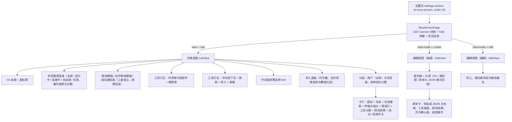
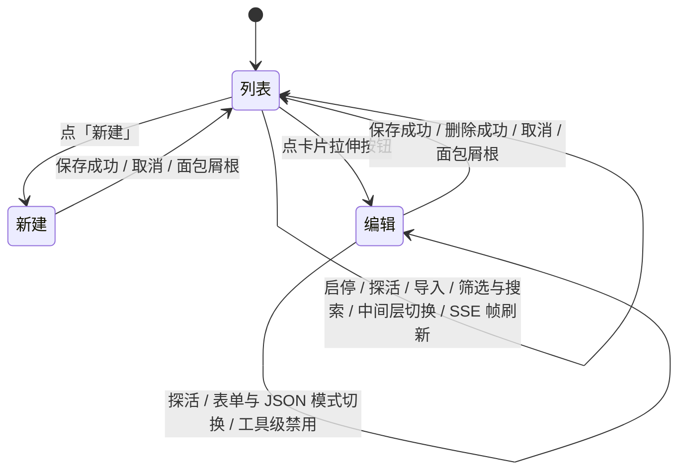

# dsh-mcp-servers 设置页 UI/UX 设计文档

> 本文是 `@dunlingzi/dsh-mcp-servers` 客户端（浏览器端，本插件的全部 UI）的 UI/UX 设计文档：
> 先按真实代码梳理现状（信息架构、页面结构、交互流程、状态呈现、边界态、无障碍、i18n），
> 再给出标注为「规划」的演进项。**全文不含 emoji。**
>
> **口径与事实源**
>
> - 本文描述的是 **`feat/settings-page-ux-a11y` 分支 @ 提交 `6a66f75`** 的形态，
>   事实源见 [§1](#snapshot)。凡断言「当前如何」，就近给出 `文件:行` 或 `文件` + 语义锚点
>   （函数名 / 常量名 / 样式段名）；**行号一律以该 SHA 的导出副本为准**。
> - 凡断言「应当如何」，一律写成「规划」，与现状分节分列，不混写。
> - 本文不重复搬运 [包 README](../../packages/dsh-mcp-servers/README.md)（用户面用法）、
>   [系统架构总览](../architecture/dsh-mcp-servers.md)（双轨模型面 / 连接状态机 / 中间层机制）、
>   [DEVELOPMENT](../DEVELOPMENT.md)（客户端干净模块与 CSS 构建契约）；只写 UI/UX 面，需要时引用。
> - 宿主 REST / SSE 只作为「UI 依赖什么」的依据，不做成篇展开。
> - 文档与代码冲突**只记录、不改任何一边**，逐条给证据，见 [§11](#issues)。
> - 本文与同批次产出的 [前端样式规范](./style-spec.md) 分工：本文管结构、流程与语义，
>   style-spec 管 token、类名与样式落地细则。
> - 本文只读代码产出：未执行构建 / 测试 / lint / 浏览器实测，对比度等样式结论标注了推算依据。

<a id="snapshot"></a>
## 1. 事实源与快照

### 1.1 本文锚定的形态

| 项 | 值 |
|---|---|
| 分支 | `feat/settings-page-ux-a11y` |
| 提交 | `6a66f75` |
| 导出方式 | 仓库外只读 `git archive` 导出（未改动工作区） |
| 导出副本 | `仓库外只读暂存目录` |
| 覆盖范围 | `packages/dsh-mcp-servers/src/**`（含 client 全部）、包 `README.md`、`shared/client/**`、`shared/README.md`、`docs/DEVELOPMENT.md`、`docs/architecture/**` |

> **重要口径提示**：仓库主 checkout **可能不在该分支上**（本会话进行中被切换到
> `task/p0-peer-range-gate` 并提交 `d8720d2`），且随时可能再被切走。
> **本文全部行号锚点以 `6a66f75` 的导出副本为准**，不得用主 checkout 的行号校对本文；
> 若要复核，请重新按同一 SHA 导出后再比对。

### 1.2 与「main 形态」的关系

上一版本文档描述的是 **main 形态**（`style.css` 454 行、无 `@media`、无 `:focus-visible`、
无 `.ms-card-hit`）。本版按 feat 形态全部重新取证，**两形态在客户端差异很大**：
`style.css` 851 行（含筛选 chip、分段控件、卡片拉伸按钮、工具面板、可访问性段、720px 响应式段），
客户端改动量级 +1400/-300 行（`ListView` +454、`EditView` +399、`style.css` +597）。
逐项对照见 [附录 A](#appendix)。

### 1.3 本次核实的文件清单（行数为该 SHA 实际值）

| 文件 | 行数 | 在本文中的作用 |
|---|---|---|
| `src/client/index.ts` | 101 | 装配、slot 注册、i18n 接线、样式注入 |
| `src/client/page/McpServersPage.tsx` | 257 | 页面容器、视图切换、SSE 与自愈 |
| `src/client/page/ListView.tsx` | 507 | 列表视图（筛选 / 搜索 / 卡片 / 导入） |
| `src/client/page/EditView.tsx` | 496 | 编辑 / 新建视图（含工具级禁用面板） |
| `src/client/core/constants.ts` | 80 | API 路径、状态表、状态簇 |
| `src/client/core/api.ts` | 69 | 请求封装、cwd 参数拼装、全名拼装 |
| `src/client/core/args.ts` | 73 | 文本与结构化配置互逆编解码 |
| `src/client/core/session.ts` | 68 | 会话绑定与重绑 |
| `src/client/core/i18n.ts` | 18 | 状态文案求值（现状无调用点，见 [§9.3](#i18n)） |
| `src/client/locales.ts` | 235 | 双语字典（zh 101 键） |
| `src/client/style.css` | 851 | 全部样式（13 个分层段） |

<a id="overview"></a>
## 2. 概览

### 2.1 一句话定位

DSH 设置页里一个名为「MCP 服务器」的独立 section，用于管理 MCP 服务器的增删改查、启停、
单次探活、工具级禁用与中间层模式热切换；UI 全部由客户端包承担，宿主端只提供 REST + SSE 与状态投影。

- 槽位注册：`settings.section`，`id = "mcp-servers"`，`order = 18`，标签走 i18n 命名空间
  `mcpServers` 的 `nav` 键（`client/index.ts:71-83`；`locales.ts:24`）。
- 页面组件：`McpServersPage`，内部三态视图 `list / edit / create`
  （`page/McpServersPage.tsx:45` 的 `PageView` 类型；`:55` 的 `view` state）。
- 常驻副作用：`apply` 时即绑定会话（不依赖设置页是否打开），项目级 MCP 跟随当前会话 cwd
  （`client/index.ts:63-64`；`core/session.ts` 的 `bindSession`）。

### 2.2 目标用户与四类使用场景

| 场景 | 用户意图 | 入口与主要动作 | 成功判据（UI 可见） |
|---|---|---|---|
| 首次配置 | 把一台 MCP 服务器接进来 | 设置 → MCP 服务器 → 「新建」→ 表单或 JSON → 保存 | 列表出现卡片，状态徽章由「未连接」转「运行中」，卡片显示工具数 |
| 批量接续 | 从别的客户端整体搬过来 | 工具栏「导入」→ 粘贴 mcpServers JSON → 选作用域 → 导入 | 绿色通知条「已导入 {n} 台，跳过 {m} 台」，列表出现新卡片 |
| 日常运维 | 增删改、临时停用、收敛模型面策略、逐工具收权 | 卡片开关、点卡片进编辑、编辑页工具面板开关、中间层下拉、状态簇筛选与搜索 | 开关即时反映启停；工具开关即时改「已禁用」计数；中间层下拉热切换无重启 |
| 故障排查 | 判断某台服务器为什么不可用 | 看状态徽章与卡片错误行、点「测试」探活、看页面错误横幅、按「失败」簇筛选 | 探活返回「连接正常 · {latency}ms · {tools} 个工具」或「连接失败：{error}」 |

四类场景都以列表视图为枢纽：列表是唯一入口页，编辑视图是唯一操作页（无独立路由）。

### 2.3 入口与可达路径

- 主入口：DSH GUI「设置」→ 左侧菜单「MCP 服务器」（`client/index.ts:71-83`）。
- 次级可达：插件不注册其它入口——浮窗时代的「设置 → 插件」配置卡已不再注册
  （历史断言见上一版记录；本 SHA 的导出未含 `test/**`，见 [§11.1](#issues)）。
- 视图内可达：列表 → 点卡片进编辑 / 点「新建」进新建；编辑视图 → 面包屑根或「取消」回列表
  （`page/EditView.tsx:344-350` 的面包屑；`:318-322` 的 `requestClose`）。
- 现状约束：视图切换只存在于组件 state（`page/McpServersPage.tsx:55`），不进 URL 与浏览器历史；
  浏览器后退会离开设置页而不是回到列表，页面刷新一律回到列表。视图状态进 URL 属「规划」（见 [§10.2](#principles)）。
- 插件不控制设置页外壳（导航、容器、滚动），只贡献 section 内容；页面自身宽度上限 920px 居中
  （`style.css` 的 `.ms-page`，`max-width: 920px`）。

<a id="ia"></a>
## 3. 信息架构

### 3.1 顶级 section 的位置与标签

| 项 | 值 | 证据 |
|---|---|---|
| 槽位 | `settings.section` | `client/index.ts:71-83` |
| section id | `mcp-servers` | `client/index.ts:75` |
| 排序 | `order: 18` | `client/index.ts:76` |
| 标签 | `label: () => sharedT("nav")`，即「MCP 服务器」/「MCP Servers」 | `client/index.ts:77`；`locales.ts:24, 138` |
| 字典命名空间 | `locale: NS`，`NS = "mcpServers"` | `client/index.ts:78`；`locales.ts:235` |
| 注入面 | `inject: () => ({ ctx, shared })`（ctx + 共享会话状态） | `client/index.ts:79` |
| 组件 | `McpServersPage` | `client/index.ts:81` |
| 客户端服务依赖 | `inject = ["sessions", "slots", "locale"]` | `client/index.ts:101` |
| 挂载失败策略 | 只 `console.warn` 不抛，绝不让 GUI 启动失败 | `client/index.ts:93-95` |

### 3.2 两视图的信息层级



列表视图线框（类名即 `style.css` 中的选择器）：

```text
+----------------------------------------------------------------------+
| MCP 服务器                                    .ms-title              |
| 管理 DeepSeek Harness 的 MCP 服务器：…         .ms-subtitle           |
| (全部 12)(运行中 9)(连接中 1)(未连接 1)(失败 1)  .ms-filters/.ms-chip  |
| [加载失败：…]                                  .ms-error-banner       |
| [操作失败：…]                                  .ms-error-banner       |
| [已导入 3 台，跳过 1 台]                        .ms-ok-banner          |
| +------------------------------+  +--------------------------------+ |
| | [全部|用户|项目]  [搜索…]     |  | 中间层模式 [project v] [刷新][导入][新建] | |
| | .ms-seg  .ms-search          |  | .ms-mode-label .ms-select .ms-btn      | |
| +------------------------------+  +--------------------------------+ |
| project：项目级服务器收敛为 ws_mcp_* 四个原子工具；…   .ms-hint        |
| +-- 导入面板（可折叠）-----------------------------+                  |
| | 导入 mcpServers JSON  .ms-import-head            |                  |
| | [textarea .ms-json]                              |                  |
| | 作用域 [项目 v] .ms-import-scope                 |                  |
| | [x] 覆盖同名服务器   [取消][导入]                 |                  |
| +--------------------------------------------------+                  |
| 用户（全局） 3                                  .ms-group-title      |
| +------------------------------------------------------------------+ |
| | [图标] 名称  (• 运行中)                          [测试]  (开关)   | |
| |        stdio · npx -y xxx        .ms-card-sub                    | |
| |        12 个工具 · 2 个已禁用     .ms-card-tools                 | |
| |        [连接正常 · 45ms · 12 个工具] .ms-probe-ok                | |
| +------------------------------------------------------------------+ |
| 项目级 2                                                             |
| ...                                                                  |
+----------------------------------------------------------------------+
```

编辑视图线框：

```text
+----------------------------------------------------------------------+
| MCP 服务器 > 编辑 MCP 服务器         .ms-breadcrumb                   |
| 编辑 MCP 服务器                          [表单][JSON]  .ms-mode-switch |
| 修改当前 MCP 配置，保存后返回列表并自动重连。                          |
| [保存失败：…]                            .ms-error-banner             |
| +------------------------------------------------------------------+ |
| | 名称 [____]（编辑态 disabled）  作用域 [用户 v]（编辑态 disabled） | |
| |   唯一标识，保存后不可修改       全局配置存 <DSH_HOME>/dsh-mcp.json| |
| | 类型 [stdio（本地命令） v]      超时（毫秒）[30000]                | |
| |   工具调用超时，留空用默认（30000）                                | |
| | 命令 [____] / 参数 [____] / 环境变量 [textarea] / 工作目录 [____]  | |
| |   （streamable-http 分支：URL + 请求头）                          | |
| | ---- 工具面板（仅编辑态）----   .ms-tools                          | |
| | 工具  共 12 个，已禁用 2 个                                        | |
| | [tool_a                        (开关)]  .ms-tool-row              | |
| | [tool_b                        (开关)]  .ms-tool-name-off         | |
| | 禁用后该工具对模型不可见——…      .ms-field-hint                   | |
| | [连接失败：…]                        .ms-probe-fail                | |
| | [有未保存的改动，确认返回列表？] [继续编辑][放弃改动]  .ms-confirm | |
| | [删除]                              [测试] [取消] [保存]          | |
| +------------------------------------------------------------------+ |
+----------------------------------------------------------------------+
```

### 3.3 视图状态机



现状要点：

- 编辑视图的两种模式（表单 / JSON）共用同一套底部操作，切换不重建组件
  （`page/EditView.tsx:209-232` 的 `switchMode`；`:356-359` 的模式切换控件）。
- **双向镜像（本版新增）**：切到 JSON 会把当前表单序列化过去（`:211-216`），切回表单会把
  JSON 解析回填（`:218-231`）；解析失败则停在 JSON 并报错，不静默丢弃。文案
  `jsonSyncHint`（`locales.ts:75`）在 JSON 模式顶部常驻说明该语义。
- **未保存改动拦截（本版新增）**：`dirty` 由表单镜像与 JSON 侧各自与基线比较得出
  （`:179-193`），取消 / 面包屑根返回时若有改动则弹页内确认条 `discard`（`:318-322`）；
  保存中（`busy`）时返回被忽略，避免错误横幅落在已卸载页面（`:318-319` 注释即此语义）。
- 编辑页取 `summary` 里的**实时行**而非点击时刻快照：SSE 推送或手动刷新后
  `status` / `tools` / `disabledTools` 跟着新快照走，找不到时才回落点击时的快照
  （`page/McpServersPage.tsx:224-230`）。

<a id="structure"></a>
## 4. 页面结构与组件树

### 4.1 列表视图（`ListView`）区块顺序

| 序 | 区块 | 类名 | 职责 | 证据 |
|---|---|---|---|---|
| 1 | 标题 / 副标题 | `.ms-title` / `.ms-subtitle` | 页面身份与一句话说明 | `page/ListView.tsx:350-351` |
| 2 | 状态簇筛选条 | `.ms-filters` / `.ms-chip` / `.ms-chip-active` / `.ms-chip-count` | 五枚 chip：全部 + 四簇，既是图例也是筛选器，带计数 | `page/ListView.tsx:353-373` |
| 3 | 加载错误横幅 | `.ms-error-banner` | 页面级错误（快照加载失败、中间层切换失败） | `page/ListView.tsx:376` |
| 4 | 动作错误横幅 | `.ms-error-banner` | 动作级错误（启停 / 导入 / 探活等），与 3 各自独立 | `page/ListView.tsx:377` |
| 5 | 成功通知条 | `.ms-ok-banner` | 导入回执等正向结果 | `page/ListView.tsx:378` |
| 6 | 工具行左 | `.ms-toolbar-left` | 作用域分段控件（全部 / 用户 / 项目）+ 搜索框 | `page/ListView.tsx:381-403` |
| 7 | 工具行右 | `.ms-toolbar-right` | 中间层下拉（带 `label`）+ 刷新 + 导入 + 新建 | `page/ListView.tsx:404-436` |
| 8 | 中间层效果说明 | `.ms-hint` | 常驻解释当前档位的模型面差异（按当前模式动态取键） | `page/ListView.tsx:342-346, 438` |
| 9 | 导入面板 | `.ms-form-card.ms-import` | 可折叠；JSON 文本域 + 作用域选择 + 覆盖勾选 + 底部操作 | `page/ListView.tsx:440-485` |
| 10 | 分组 | `.ms-group-title` / `.ms-group-count` | 用户（全局）/ 项目级两组，组内计数；空组整块不渲染 | `page/ListView.tsx:315-321, 489-490` |
| 11 | 卡片列表 | `.ms-cards` | 纵向排列卡片 | `page/ListView.tsx:322` |
| 12 | 卡片 | `.ms-card` 及其子块 | 拉伸按钮 + 图标 + 名称 + 状态徽章 + 副标题 + 错误行 + 工具计数 + 探活结果 + 操作区 | `page/ListView.tsx:144-212` |
| 13 | 空态 / 提示 | `.ms-empty` / `.ms-hint` | 空列表、筛选无结果、项目级无配置三类文案 | `page/ListView.tsx:491-502` |

### 4.2 编辑视图（`EditView`）区块顺序

| 序 | 区块 | 类名 | 职责 | 证据 |
|---|---|---|---|---|
| 1 | 面包屑 | `.ms-breadcrumb` / `-root` / `-sep` / `-current` | 根按钮（回列表，带 `aria-label`，保存中禁用）+ 当前段 | `page/EditView.tsx:344-350` |
| 2 | 头部 | `.ms-edit-head` | H1 + 副标题；右侧表单 / JSON 模式切换（`role="group"` + `aria-pressed`） | `page/EditView.tsx:351-360` |
| 3 | 错误横幅 | `.ms-error-banner`（`role="alert"`） | 本地校验失败、保存失败、删除失败、工具禁用失败 | `page/EditView.tsx:361` |
| 4 | 表单卡 | `.ms-form-card` | 表单分支：名称 / 作用域 / 类型 / 超时 + 按传输分支的字段 | `page/EditView.tsx:362-425` |
| 5 | JSON 文本域 | `.ms-json` | JSON 分支：镜像配置对象（16 行，等宽字体），上方带同步语义 hint | `page/EditView.tsx:427-437` |
| 6 | 工具面板 | `.ms-tools` 及其子块 | 仅编辑态：逐工具启停（`PATCH /tool-disable`）+ 计数 + 三条 hint | `page/EditView.tsx:439-450`；组件体 `:43-120` |
| 7 | 探活结果 | `.ms-probe-ok` / `.ms-probe-fail` / `.ms-probe-pending` | 编辑态测试按钮的结果行（`role="status"` + `aria-live`） | `page/EditView.tsx:451-459` |
| 8 | 页内确认条 | `.ms-confirm` / `-text` / `-actions` | 删除与放弃改动两种确认，替代 `window.confirm` | `page/EditView.tsx:460-478` |
| 9 | 底部操作 | `.ms-form-footer` / `-right` | 左：删除（仅编辑态）；右：测试（仅编辑态）、取消、保存 | `page/EditView.tsx:479-492` |

### 4.3 组件清单

| 组件 / 区块 | 类名前缀 | 职责 | 数据来源 | 关键交互 |
|---|---|---|---|---|
| `McpServersPage` | 无自有类名（页面根由子视图的 `.ms-page` 承担） | 视图切换、快照与 SSE、会话自愈、中间层切换、编辑页实时行解析 | `GET /servers`、`SSE /events` | 三态视图切换；`onMiddlewareChange` 乐观更新 + 失败回滚 |
| `ListView` | `.ms-page` | 列表视图整体 | 父组件传入的 `summary` / `middleware` / `error` | 筛选、搜索、刷新、导入、新建、进编辑 |
| 状态簇 chip | `.ms-chip` | 全部 + 运行中 / 连接中 / 未连接 / 失败四簇过滤 | 本地 state `statusFilter` + `STATUS_BUCKETS` | `aria-pressed`；点已激活 chip 复位为「全部」 |
| 作用域分段控件 | `.ms-seg` / `.ms-seg-btn` / `.ms-seg-active` | 全部 / 用户 / 项目过滤 | 本地 state `scopeFilter` | `role="group"` + `aria-label` + `aria-pressed` |
| 搜索框 | `.ms-search` | 按名称与端点摘要子串匹配（大小写不敏感） | 本地 state `query` | `type="search"`；`placeholder` 与 `aria-label` 同源 |
| 刷新按钮 | `.ms-btn.ms-btn-ghost.ms-btn-icon` | 手动补拉快照 | `GET /servers` | 内联 SVG 图标（非字形字符）；带 `aria-label` 与 `title` |
| 导入按钮 | `.ms-btn.ms-btn-ghost` | 折叠 / 展开导入面板 | 本地 state `importOpen` | `aria-expanded` |
| 新建按钮 | `.ms-btn.ms-btn-primary` | 进入新建视图 | — | 内联 SVG 加号 + 文案（不再是字面量「+ 新建」） |
| 导入面板 | `.ms-import` / `.ms-import-head` / `.ms-import-scope` / `.ms-check` | 粘贴 JSON、选作用域、勾选覆盖 | 本地 state ×4 | 客户端解包 `{mcpServers:{…}}`；提交走 `POST /import/json` |
| 分组容器 | `.ms-group-title` / `.ms-group-count` | 用户（全局）/ 项目级分组与计数 | 客户端按 `server.scope` 分组 | 空组不渲染 |
| 卡片 | `.ms-card` | 单台服务器的信息与操作容器 | `summary.servers[]` | 卡片主操作由拉伸按钮承担（见下） |
| 卡片拉伸按钮 | `.ms-card-hit` | 整卡点击进编辑，键盘可达且有可读名 | — | 绝对定位覆盖整卡（`inset: 0`，`z-index: 1`），`aria-label` = `editAria{name}` |
| 状态徽章 | `.ms-badge` / `.ms-badge-danger` / `.ms-dot` | 状态点 + 状态文字双通道 | `statusDot` / `statusTone` / `statusTextKey` | 无交互；色点 `aria-hidden` |
| 卡片图标 | `.ms-card-glyph` | 内联 SVG 服务器图标，跟随 `currentColor` | 静态 | `aria-hidden` + `focusable="false"` |
| 卡片副标题 | `.ms-card-sub` | `传输 · 端点`（失败详情另起一行，不再挤进摘要） | `transport` / `command` / `args` / `url` | `nowrap` + 省略号 |
| 卡片错误行 | `.ms-card-error` | 仅 `failed` 态：`错误 · {error}`，两行截断 | `server.error` | 整卡 `title` 同时挂完整错误 |
| 工具计数行 | `.ms-card-tools` | `{n} 个工具` 与 `{n} 个已禁用`（仅在有值时渲染） | `tools` / `disabledTools` | 无 |
| 探活结果行 | `.ms-probe-ok` / `.ms-probe-fail` / `.ms-probe-pending` | 卡片内联探活结论 | `POST /servers/probe` 返回值 | `role="status"` + `aria-live="polite"`，会被读屏播报 |
| 探活按钮 | `.ms-btn.ms-btn-ghost` | 单次探活 | 同上 | 20s 超时；pending 时禁用且文案变「测试中…」 |
| 启停开关 | `.ms-switch` / `.ms-switch-slider` / `.ms-switch-busy` | 启用 / 停用一台服务器 | `enabled !== false && status !== "disabled"` | `role="switch"` + `aria-checked` + `aria-label`；busy 期间 `pointer-events: none` |
| 空态 | `.ms-empty` | 空列表 / 无搜索结果 / 筛选无结果 | 本地计算 | 无 |
| 模式切换 | `.ms-mode-switch` / `.ms-mode-active` | 表单 / JSON 切换 | 本地 state `mode` | `role="group"` + `aria-pressed` |
| 表单字段 | `.ms-field` / `.ms-field-row` / `.ms-label` / `.ms-field-hint` | 字段布局与说明 | 本地 state | **每个 `label` 都有 `htmlFor` 与控件 `id` 配对** |
| 输入控件 | `.ms-input` / `.ms-textarea` / `.ms-json` | 文本、多行键值、JSON 编辑 | 本地 state | `:focus` 换边框色；全页 `:focus-visible` 统一焦点环 |
| 工具面板 | `.ms-tools` / `-head` / `-summary` / `-list` / `-empty` / `.ms-tool-row` / `.ms-tool-name` / `-off` | 逐工具启停与计数 | `server.tools` / `server.disabledTools` + 本地 `disabled` Set | `PATCH /tool-disable`；`role="switch"` + `aria-label`；列表 `max-height: 320px` 可滚动 |
| 页内确认条 | `.ms-confirm` / `-text` / `-actions` | 删除 / 放弃改动二次确认 | 本地 state `confirming` | `role="alertdialog"` + `aria-live="assertive"`；危险动作走 `.ms-btn-danger-solid` |
| 底部操作 | `.ms-form-footer` / `-right` | 删除 / 测试 / 取消 / 保存 | `busy` / `probe` state | 保存中禁用并显示「保存中…」 |

### 4.4 样式分层与主题变量（现状）

- 单一文件 `src/client/style.css`，构建期由 text-loader 原样内联进 `lib/client.js`
  （`client/index.ts:15` 的 `import STYLE from "./style.css"`；[DEVELOPMENT](../DEVELOPMENT.md) §3）。
- 类名统一 `ms-` 前缀（`style.css` 文件头注释第 4 行）。
- **分层注释共 13 段**（`style.css:19-22` 的分层约定 + 各段标题）：
  1 骨架（`:24`）/ 2 横幅（`:52`）/ 3 筛选条（`:73`）/ 4 工具行（`:117`）/ 5 按钮（`:201`）/
  6 分组与卡片（`:262`）/ 7 徽章与探活（`:392`）/ 8 开关（`:447`）/ 9 编辑页（`:507`）/
  10 导入面板（`:699`）/ 11 工具面板（`:724`）/ 12 可访问性（`:783`）/ 13 响应式（`:797`）。
- 配色纪律写在文件头（`style.css:6-17`）：只使用 DSH 主题真实存在的 token，并沿用官方 pairing
  （输入框 `border-l4` + `bg-layer-1`；卡片 `border-l2`；主按钮 `button-primary-fill` +
  `label-primary-foreground`；焦点环 `state-business-primary`；链接 `link`），
  变量一律带浅色回退。

| 变量 | 用途 | 回退值 | 证据 |
|---|---|---|---|
| `--dsw-alias-label-primary` | 正文、错误/确认条文字 | `#0f1115` | `.ms-page`、`.ms-confirm` |
| `--dsw-alias-label-secondary` | 副标题、组标题、卡片副标题、徽章文字 | `#61666b` | `.ms-subtitle`、`.ms-badge` |
| `--dsw-alias-label-tertiary` | hint、工具计数、空态、未选中色点 | `#81858c` | `.ms-hint`、`.ms-card-tools`、`.ms-empty` |
| `--dsw-alias-label-primary-foreground` | 主按钮 / 分段激活 / 危险实心按钮文字 | `#fff` | `.ms-btn-primary`、`.ms-seg-active` |
| `--dsw-alias-border-l1` / `-l2` / `-l4` | 分隔线 / 卡片与容器 / 输入与激活边框 | `rgba(0,0,0,0.04)` / `0.1` / `0.16` | `.ms-tools`、`.ms-card`、`.ms-input` |
| `--dsw-alias-bg-layer-1` | 输入控件底 | `transparent` | `.ms-input`、`.ms-search`、`.ms-json` |
| `--dsw-alias-interactive-bg-hover` | 悬停底、徽章底、图标底、pending 探活底 | `rgba(38,49,72,0.06)` | `.ms-chip:hover`、`.ms-badge` |
| `--dsw-alias-interactive-bg-hover-accent` | 激活 chip 底 | `rgba(38,49,72,0.14)` | `.ms-chip-active` |
| `--dsw-alias-interactive-bg-hover-danger` | 错误横幅底、危险悬停底、失败探活底 | `rgba(236,19,19,0.08)` | `.ms-error-banner`、`.ms-probe-fail` |
| `--dsw-alias-button-primary-fill` / `-hover` | 主按钮与分段激活底 | `#0f1115` / `#43454a` | `.ms-btn-primary`、`.ms-seg-active` |
| `--dsw-alias-state-business-primary` | 焦点环、输入聚焦边框 | `#4176e6` | `.ms-page :focus-visible`、`.ms-input:focus` |
| `--dsw-alias-state-success-primary` / `-tertiary` | 开关开启、`connected` 色点 / 成功通知条与探活成功底 | `#22c55e` / `#e6faed` | `.ms-switch input:checked + .ms-switch-slider` |
| `--dsw-alias-state-error-primary` | 错误文字、删除按钮、`failed` 色点与徽章 | `#ec1313` | `.ms-btn-danger`、`.ms-badge-danger` |
| `--dsw-alias-state-warn-secondary` / `-tertiary` | 确认条边框 / 底 | `#f7ad31` / `#fef5e7` | `.ms-confirm` |
| `--dsw-alias-link` | 面包屑根按钮 | `#4176e6` | `.ms-breadcrumb-root` |
| `--dsw-alias-state-warn-primary` / `--dsw-alias-state-business-primary` / `--dsw-alias-label-tertiary` | `reconnecting` / `connecting` / `stopped`、`disabled` 色点 | 见 `core/constants.ts:34-41` | 色点颜色由 JS 内联注入 |

- 已落地（上一版列为「规划」的三项，本版改为现状）：
  - **统一焦点环**：`.ms-page :focus-visible` 给全页 2px 品牌色轮廓 + 2px 偏移
    （`style.css:785-788`）；开关另有 `input:focus-visible + .ms-switch-slider` 分支
    （`:497-500`）；拉伸按钮有独立 `:focus-visible`（`:310-313`）。
  - **动效降级**：`@media (prefers-reduced-motion: reduce)` 关掉开关滑块过渡（`:790-795`）。
  - **响应式断点**：`@media (max-width: 720px)`（`:799-851`），工具栏单列化、
    按钮与 chip 触控高度提到 36px、卡片操作区换行占满、字段行改纵向、表单卡内边距收窄。
- 已知偏差（记录，见 [§11.2](#issues)）：`.ms-switch-slider::before` 的滑块底色写死 `#fff`
  （`style.css:485`），与 [DEVELOPMENT](../DEVELOPMENT.md) §6 第 3 条「不要在 CSS 写死 `#fff`」
  字面冲突；从设计意图看是开关滑块的跨主题常量（深色下轨道为语义色、滑块需高对比），
  属有意为之但未加注释说明。
- 未做浏览器实测：窄屏与深色主题下的实际表现（含对比度）需按
  [DEVELOPMENT](../DEVELOPMENT.md) §6 的验证要求实测复核，本文只做静态推算。

<a id="flows"></a>
## 5. 交互流程

### 5.0 流程总表

| 流程 | 入口 | 关键请求 | 成功反馈 | 失败与回滚 |
|---|---|---|---|---|
| 新增（表单） | 「新建」 | `POST /servers`（body 含 `name`/`scope`，URL 带 `?cwd=`） | 关闭编辑视图 + 立即刷新 | 页内横幅「保存失败：{msg}」，输入保留 |
| 新增（JSON） | 「新建」→「JSON」 | `POST /servers`（body 为粘贴对象；`name` 取 JSON 优先，`scope` 取 JSON 或表单选择） | 同上 | 本地解析失败拦在提交前；其余同上 |
| 编辑 | 点卡片拉伸按钮 | `PATCH /servers?name=&scope=&cwd=` | 宿主 merge + 重连，客户端关视图 + 刷新 | 页内「保存失败」横幅，输入保留 |
| 删除 | 编辑视图底部「删除」→ 页内确认条 | `DELETE /servers?name=&scope=&cwd=` | 关视图 + 刷新 | 确认条可取消；失败走「操作失败」横幅 |
| 启用 / 禁用 | 卡片开关 | `PATCH /servers`（+ 开启时 `POST /servers/connect`） | 开关即时反映；`onRefresh` 补拉快照 | 页内「操作失败」横幅（不再是 `alert`） |
| 探活 | 卡片「测试」/ 编辑页「测试」 | `POST /servers/probe`（20s 超时） | 绿底行报延迟与工具数 | 红底行「连接失败：{error}」 |
| 工具级禁用 | 编辑页工具面板开关 | `PATCH /tool-disable`（body `{server, tool, disabled}`） | 行内开关即时翻转 + 计数更新 + 回列表刷新快照 | 页内「操作失败」横幅；开关由下一次渲染回落 |
| 中间层模式切换 | 工具行「中间层模式」下拉 | `POST /config` | 热生效 + 落盘，随后刷新校准 | 回滚下拉选择 + 页内横幅 |
| JSON 导入 | 工具栏「导入」面板 | `POST /import/json` | 绿色通知条「已导入 {n} 台，跳过 {m} 台」，面板关闭并清空 | 页内「导入失败：{msg}」或「没有解析到任何服务器」 |
| 筛选与搜索 | 状态 chip / 作用域分段控件 / 搜索框 | 无请求（纯本地过滤） | 列表与空态即时变化 | 无（无失败路径） |

### 5.1 新增（表单模式）

- 入口：列表工具行「新建」（`page/ListView.tsx:433-435`）→ `onCreate()` →
  `setView({ mode: "create" })`（`page/McpServersPage.tsx:253`）。
- 步骤：名称（必填，`validate` 拦空）→ 作用域（用户 / 项目，带含义 hint）→ 类型
  （stdio / streamable-http）→ 超时毫秒（可选，正整数）→ 传输分支字段：stdio 为
  命令 / 参数 / 环境变量 / 工作目录，http 为 URL / 请求头。
- 请求：`POST /api/dsh-mcp-servers/servers`，body 为 payload + `name` + `scope`，
  路径经 `withCwd` 带 `?cwd=<会话 cwd>`（`page/EditView.tsx:253-262`；`core/api.ts:37-40`）。
- 成功反馈：`onSaved` → 关闭编辑视图 + 立即 `refresh()`（`page/McpServersPage.tsx:238-241`）。
- 失败与回滚：HTTP 非 2xx → 页内横幅「保存失败：{msg}」，表单输入保留可重试
  （`page/EditView.tsx:263-266`）；项目级在无活动项目会话时宿主抛错，同样落到该横幅。
- 提交前校验（`page/EditView.tsx:238-250`）：名称非空、超时为正整数毫秒、stdio 必须有命令、
  非 stdio 必须有 URL；命中即就地报错、不发请求。

### 5.2 新增（JSON 模式）

- 入口：编辑视图右上「JSON」（`page/EditView.tsx:356-359`）；新建时文本域预置
  `{"name":"","transport":"stdio","command":"","args":[]}`（`page/EditView.tsx:141`）。
- 步骤：粘贴 JSON → 保存；`name` 以 JSON 里的值为优先，空则回落表单名称框
  （`page/EditView.tsx:284`）。
- **作用域（本版修正）**：`scope` 先取 JSON 里的合法值（`project` / `global`），
  否则回落表单选择（`page/EditView.tsx:286`），随 `saveWith` 一并提交
  （`:261`）——不再出现「选了项目却静默存进全局」。
- 本地校验：解析失败或非对象一律拦在提交前，横幅「JSON 解析失败：{msg}」
  （`page/EditView.tsx:273-281`）。
- 成功 / 失败反馈：同 5.1。

### 5.3 编辑

- 入口：点卡片拉伸按钮（`page/ListView.tsx:152-157`）→ `onEdit(server)` →
  `setView({ mode: "edit", server })`（`page/McpServersPage.tsx:254`）。
- 步骤：名称与作用域只读（`page/EditView.tsx:368, 373` 的 `disabled`）→ 修改其它字段，
  或切 JSON 直接编辑配置对象（回显时剔除 `name` / `scope` / `status` / `error` / `tools` /
  `disabledTools`，`page/EditView.tsx:138`）→ 保存。
- 请求：`PATCH /servers?name=&scope=&cwd=<会话 cwd>`（`page/EditView.tsx:148-150, 257`）。
- 成功反馈：宿主 merge → 落盘 → 重连；客户端关视图 + 刷新（`page/McpServersPage.tsx:238-241`）。
- 失败与回滚：页内「保存失败」横幅，输入保留（`page/EditView.tsx:265`）。
- 实时性：编辑页渲染的是 `summary` 里的**同名同行**（`page/McpServersPage.tsx:227-230`），
  因此 SSE 刷新后状态 / 工具列表跟着更新，不停留在点开那一刻。
- 现状缺口：编辑视图不消费页面级 `error`——`McpServersPage` 只在列表分支传 `error`
  （`page/McpServersPage.tsx:245-255`），所以编辑中若后台刷新失败，用户看不到（见 [§11.2](#issues) C4）。

### 5.4 删除

- 入口：编辑视图底部左侧「删除」，仅编辑态渲染（`page/EditView.tsx:480-482`）。
- 步骤：点「删除」只置 `confirming = "delete"`（`:481`），**不立即发请求**；
  页内确认条出现并给出「确认删除 MCP 服务器「{name}」？该操作不可撤销。」
  （`locales.ts:102`；渲染 `page/EditView.tsx:460-478`）→ 点「确认删除」才走 `onDelete`。
- 请求：`DELETE /servers?name=&scope=&cwd=`（`page/EditView.tsx:304-312`）。
- 成功反馈：宿主移除 + 落盘；客户端 `onSaved` → 关视图 + 刷新。
- 失败与回滚：点「取消」关闭确认条即中止；请求失败走「操作失败：{msg}」横幅
  （`page/EditView.tsx:310`）。
- 形态变化：本版改为**页内确认条**（`role="alertdialog"` + `aria-live="assertive"`），
  不再使用浏览器原生 `window.confirm`（不可样式化、不随主题、阻塞）。

### 5.5 启用 / 禁用（卡片开关）

- 入口：卡片右侧开关（`page/ListView.tsx:198-208`）；开关初值由
  `server.enabled !== false && server.status !== "disabled"` 计算（`page/ListView.tsx:146`）。
- 步骤：切换 → 该卡立即进入 busy（`.ms-switch-busy`：60% 透明 + `pointer-events: none`）
  → `PATCH /servers { enabled }` → 若为开启再 `POST /servers/connect`（均带 `?name=&scope=&cwd=`）
  （`page/ListView.tsx:248-262`）。
- 成功反馈：`onRefresh()` 立即补拉快照；SSE 帧继续刷新。
- 失败与回滚：页内「操作失败：{msg}」横幅（`page/ListView.tsx:260`）——**本版已从原生
  `alert` 改为页内横幅**，与其它流程形态一致；本地无乐观翻转，开关值直接取自快照，
  失败后由下一次刷新回到真实状态。
- 现状缺口：busy 保护只作用于鼠标（`pointer-events: none`），开关 `input` 未 `disabled`，
  键盘用户仍可在请求进行中再次切换（见 [§8](#a11y)）。

### 5.6 探活（测试）

- 入口：卡片「测试」按钮（`page/ListView.tsx:189-197`）；编辑视图底部「测试」
  （仅编辑态，`page/EditView.tsx:484-486`）。
- 步骤：`POST /servers/probe?name=&scope=&cwd=`，客户端超时 20s
  （`page/ListView.tsx:265-281`；`page/EditView.tsx:324-336`）。
- 过程态：结果行先渲染 `.ms-probe-pending` 且文案为「测试中…」；按钮同时禁用
  （列表侧 `page/ListView.tsx:192, 196`；编辑侧 `page/EditView.tsx:485`）。
- 成功反馈：绿底行「连接正常 · {latency}ms · {tools} 个工具」（`testOk`，
  `page/ListView.tsx:274`）。
- 失败与回滚：红底行「连接失败：{error}」；宿主探活内部失败也返回 `ok: false` + `error`，
  HTTP 层异常由客户端 `catch` 兜底（`page/ListView.tsx:278-280`）。
- 语义（设计约束）：连接一次即断，不改连接状态、不注册工具
  （宿主路由注释 `api/routes-controllers.ts:272`）——因此探活与卡片状态徽章可以不一致，
  且这是预期行为。
- 可访问性（本版新增）：结果行带 `role="status"` + `aria-live="polite"`，读屏会播报
  （`page/ListView.tsx:178-186`；`page/EditView.tsx:451-459`）。
- 现状缺口：结果只存在列表组件局部 state `probeViews`（`page/ListView.tsx:219`），
  进编辑再返回即丢失。

### 5.7 工具级禁用（本版新增的真实 UI 入口）

- 入口：编辑视图工具面板，**仅编辑态渲染**（`page/EditView.tsx:439-450`）。
- 数据面：工具名来自 `server.tools`（宿主投影的裸名列表），已禁用集合来自
  `server.disabledTools`（`page/EditView.tsx:338-340`）。
- 全名拼装：`toolDisableServerKey(server, projectRoot)` —— 全局为 `@@global/<name>`，
  项目级为 `@<projectRoot>/<name>`；`projectRoot` 缺失时返回 `undefined`
  （`core/api.ts:14-18`）。
- 步骤：切换某一工具开关 → 该行进入 pending（`.ms-switch-busy`）→
  `PATCH /api/dsh-mcp-servers/tool-disable?cwd=<会话 cwd>`，body
  `{ server: 全名, tool: 裸名, disabled: !enabled }`（`page/EditView.tsx:58-79`）。
- 路径约束（实现要点）：tool-disable 路径本身无 query，必须走 `withCwd()`
  自动选分隔符；手拼 `cwdQueryOf` 的 `&cwd=` 会拼进 pathname 导致宿主 exact 路由不命中
  并返回 405（`core/api.ts:20-40` 的注释即此语义；调用点 `page/EditView.tsx:61-67`）。
- 成功反馈：本地 `disabled` Set 即时更新（`:69-74`）→ `onApplied()` = `onRefresh()`
  → 列表卡片「{n} 个已禁用」随之更新（`:75`；`page/McpServersPage.tsx:237`）。
- 失败与回滚：页内「操作失败：{msg}」横幅（`:77`）；本地 Set 不翻转，开关保持原值。
- 不可用态：`projectRoot` 拿不到（宿主重启等）时 `serverKey === undefined`，
  面板显示「当前拿不到工作空间根，工具级禁用暂不可用…」且全部开关 `disabled`
  （`page/EditView.tsx:89, 105`；`locales.ts:98`）。
- 空态：服务器未上报工具时显示「该服务器尚未上报工具（连接成功后在此列出）。」
  （`page/EditView.tsx:90-91`；`locales.ts:95`）。
- 语义提示：面板底部常驻两条 hint——三入口一致生效说明，以及全局服务器禁用记录跨工作空间
  共享说明（`page/EditView.tsx:116-117`；`locales.ts:96-97`）。
- 宿主侧护栏（解释 UI 为何这样设计）：`PATCH /tool-disable` 做 root 路由一致性校验，
  server 全名解析出的 root 必须属于当前工作空间（或 `@global`），否则 400
  （`api/routes-controllers.ts:360-374`）；tool 名先归一化剥 `mcp__<server>__` 前缀再入表
  （`:380-384`）。
- 现状缺口：面板的 `disabled` Set 只在挂载时由 props 初始化（`page/EditView.tsx:55`），
  后续 SSE 刷新带来的 `disabledTools` 变化不会同步进本地集合（面板 `key` 是
  `scope/name`，不随快照重建）。

### 5.8 中间层模式切换

- 入口：列表工具行右侧下拉，三档 `off / project / all`，带 `<label htmlFor>` 关联
  （`page/ListView.tsx:405-415`）。
- 步骤：选择 → 乐观更新本地 state（`page/McpServersPage.tsx:211`）→
  `POST /config { middleware }` → 成功后 `refresh()` 校准。
- 成功反馈：宿主先热生效再经官方 settings 命名空间落盘（`api/routes-controllers.ts:93-99`；
  `bootstrap/apply-config.ts:95-110`），无需重启；下拉下方常驻 hint 按当前档位动态取键
  解释模型面差异（`page/ListView.tsx:342-346`；`locales.ts:39-41`）。
- 失败与回滚：`catch` → `setMiddleware(prev)` 回滚选择 + 页内横幅「操作失败：{msg}」
  （`page/McpServersPage.tsx:218-221`）；宿主对非法值显式 400
  （`api/routes-controllers.ts:87-92`）。
- 现状缺口：请求进行中下拉不禁用（可连续切换，存在竞态窗口）；该失败写的是页面级
  `error`，而 `setError("")` 只在成功刷新路径执行（`page/McpServersPage.tsx:66`），
  陈旧错误可能常驻到下一次成功刷新。

### 5.9 JSON 导入（本版新增的真实入口）

- 入口：工具栏「导入」按钮展开面板（`page/ListView.tsx:425-432`），`aria-expanded` 反映状态。
- 步骤：粘贴 JSON → 选作用域 → 可选勾选「覆盖同名服务器」→ 点「导入」。
- 客户端预处理：`unwrapServers()` 解包 Claude Desktop / Cursor 的
  `{"mcpServers": {...}}` 包裹形态为裸 map；解包失败原样透传，把报错权留给宿主
  （保持单一错误来源，`page/ListView.tsx:46-57`）。
- 作用域默认值：`effectiveImportScope` 跟随当前会话——有项目根即 `project`，
  否则 `global`；用户可显式覆盖（`page/ListView.tsx:231-232`）。无项目根时
  「项目」选项 `disabled`（`:464`）。
- 请求：`POST /api/dsh-mcp-servers/import/json`，body
  `{ json, scope, overwrite, cwd? }`，超时 20s（`page/ListView.tsx:288-298`）。
- 成功反馈：绿色通知条「已导入 {imported} 台，跳过 {skipped} 台」（`:305`），
  面板关闭并清空输入（`:306-307`），随后 `onRefresh()`。
- 失败与回滚：解析不到任何服务器 → 「没有解析到任何服务器」（`:302-303`）；
  HTTP / 宿主解析异常 → 「导入失败：{msg}」（`:311`）。两者都走 `actionError` 横幅，
  输入保留在面板内可修改重试。
- 宿主语义（解释 UI 回执为何长这样）：同名且未勾选覆盖 → 进 `skipped`；勾选覆盖 →
  走 `manager.update` 并进 `imported`；否则 `manager.add`（`api/routes-controllers.ts:315-327`）。
  项目级作用域经 `projectStoreOrThrow()`，无活动项目会话时抛错并落到失败横幅。

### 5.10 筛选与搜索（纯本地，无请求）

- 状态簇 chip：`全部` + `STATUS_BUCKETS` 四簇（运行中 / 连接中 / 未连接 / 失败），
  计数由本地按同一 `match` 谓词统计（`page/ListView.tsx:244-245`；`core/constants.ts:75-80`）。
  点已激活的簇 chip 复位为「全部」（`page/ListView.tsx:368`）。
- 作用域分段控件：全部 / 用户 / 项目（`page/ListView.tsx:382-394`）。
- 搜索：按名称与端点摘要（stdio 取 `command + args`，http 取 URL）子串匹配，
  大小写不敏感（`page/ListView.tsx:21-27, 234-241`）。
- 三个条件**同时**生效（AND），分组在过滤结果上再做（`:242-243`）。
- 计数口径：chip 上的计数是**全局总数**（由未过滤的 `servers` 计算），不随作用域或搜索收窄
  ——即「计数是图例，列表是结果」。
- 空态分支（`:491-499`）：`servers.length === 0` → 「没有 MCP 服务器，点「新建」添加」；
  有搜索词 → 「没有匹配「{q}」的服务器」；否则 → 「当前筛选条件下没有服务器」。
- 现状缺口：`summary.counts`（宿主六态计数，`manager.ts:1014-1020`）客户端仍未消费，
  计数在客户端用状态簇重新算（`page/ListView.tsx:244-245`）。

### 5.11 刷新与自愈（贯穿所有流程）

- 快照：`GET /servers` 是纯读、零副作用（`api/routes-controllers.ts:126-134`），
  客户端每次 `refresh()` 全量替换 `summary`（`page/McpServersPage.tsx:60-70`）。
- 推送：SSE `/events`。帧有两种：`summary`（状态变化广播；订阅首帧
  `api/routes.ts:158`）与 `ping`（30s 心跳，`api/routes.ts:95-103`）。客户端忽略 `ping`、
  其余帧触发 `refresh()`（`page/McpServersPage.tsx:142-152`）。
- watchdog：60s 无任何帧判定半开，关旧连接重建（`WATCHDOG_MS = 60_000`，
  `page/McpServersPage.tsx:48, 102-108`）。
- 降级：连续 `CLOSED` 3 次 → 10s 轮询，每 5 tick 尝试恢复 SSE，成功即退出轮询
  （`page/McpServersPage.tsx:109-130, 153-161`）。
- 回前台：`visibilitychange`（非 hidden）与 `pageshow(persisted === true)`（iOS bfcache）
  → `rebindSession`（`POST /session`，幂等）→ `POST /resume` → `refresh()`
  （`page/McpServersPage.tsx:181-194`；`core/session.ts:26-32`）。
- 宿主重启自愈：SSE `onopen` 时探测快照的 `projectRoot` 是否丢失，丢失且本地有 cwd
  即重绑 + resume（`page/McpServersPage.tsx:137-141, 170-180`）。
- 可见后果：这些机制全部**静默**——降级到轮询、watchdog 重建、回前台强刷都没有任何 UI 提示，
  见 [§6.3](#states)。

<a id="states"></a>
## 6. 状态模型与呈现

### 6.1 宿主真实状态集合（本版重新核实）

状态集合是**六态**，事实源不是 `types/status.ts`（该文件只声明 `state: string` 形状，
不枚举取值，`src/types/status.ts:7-13`），而是：

- 产生点：`src/connection/runtime/supervisor.ts` 的 `setStatus` 调用族（`:319` 定义）；
- 投影兜底：`src/connection/orchestrator/manager.ts` 的 `summarize`（`:1041-1094`）；
- 计数面：`manager.ts` 的 `summary()`（`:1014-1022`，`counts` 初值即六态全集）；
- 客户端镜像：`src/client/core/constants.ts` 的 `STATUS_ORDER`（`:34-41`）与
  `STATUS_TEXT`（`:44-51`）。

| 状态值 | 宿主产生点 | 语义 | 备注 |
|---|---|---|---|
| `connected` | `supervisor.ts:362` | 连接 + initialize + 工具同步成功 | 目录发现失败时仍可能 `connected` 但 0 工具，原因进 `error`（`manager.ts:1058-1059`） |
| `connecting` | `supervisor.ts:341`（`failedAttempts === 0`） | 首次连接中 | 重连窗口判定用 `failedAttempts`，避免误投影（`supervisor.ts:339-341`） |
| `reconnecting` | `supervisor.ts:341`（`failedAttempts > 0`）、`supervisor.ts:424` | 有界退避重连窗口内 | 预算耗尽转 `failed`（`supervisor.ts:413-420`） |
| `stopped` | `supervisor.ts:311`（初值）、`supervisor.ts:525`（主动断开）、`manager.ts:1089`（无 supervisor 且未禁用）、`manager.ts:1069`（中间层 `userDisabled` 短路） | 未连接 | 无 supervisor 时是兜底值 |
| `disabled` | `supervisor.ts:336`（`server.enabled` 为假）、`manager.ts:1089`（同口径兜底） | 配置层面停用 | 与「连接失败」语义分离 |
| `failed` | `supervisor.ts:399`、`supervisor.ts:405`（重连禁用）、`supervisor.ts:420`（预算耗尽） | 连接失败且不再自动重试 | 唯一会在卡片上带出独立错误行的状态 |

未知状态：`statusDot` 回退灰点、`statusTone` 回退 `neutral`、`statusTextKey` 返回
`undefined`（`core/constants.ts:54-68`），而列表的 `statusLabel` 对未知状态**原样回显状态串**
（`page/ListView.tsx:35-38`）——不吞信息，也不会丢卡。

### 6.2 状态 → 视觉呈现映射（本版结论：六态全有可见文字）

| 状态 | 色点颜色（变量 + 回退值） | 卡片可见文字 | 徽章 tone 类 | 开关 | 文案键是否有渲染点 |
|---|---|---|---|---|---|
| `connected` | 绿 `--dsw-alias-state-success-primary` `#0f9d6e` | 徽章文字「运行中」 | `ms-badge-success`（未定义，回落基础样式） | 开 | 是 |
| `connecting` | 蓝 `--dsw-alias-state-business-primary` `#2f7bf6` | 徽章文字「连接中」 | `ms-badge-info`（未定义，回落） | 由 `enabled` 决定 | 是 |
| `reconnecting` | 橙 `--dsw-alias-state-warn-primary` `#e08b1e` | 徽章文字「重连中」 | `ms-badge-warn`（未定义，回落） | 同上 | 是 |
| `stopped` | 灰 `--dsw-alias-label-tertiary` `#9aa1ad` | 徽章文字「未连接」 | `ms-badge-neutral`（未定义，回落） | 同上 | 是 |
| `disabled` | 灰 `--dsw-alias-label-tertiary` `#9aa1ad` | 徽章文字「已停用」 | `ms-badge-neutral`（未定义，回落） | 关 | 是 |
| `failed` | 红 `--dsw-alias-state-error-primary` `#e0483e` | 徽章文字「失败」+ 独立错误行「错误 · {error}」 | `ms-badge-danger`（**唯一定义了样式的 tone**） | 同上 | 是 |
| 未知值 | 灰兜底 | 徽章原样回显状态串 | `ms-badge-neutral`（回落） | 同上 | 是（回显原文） |

要点：

- **颜色不再是唯一线索**（本版推翻上一版结论）：`StatusBadge` 同时渲染色点与文字
  （`page/ListView.tsx:105-112`），六态文案键全部有渲染点。
- tone 类只实现了一档：`statusTone` 返回 5 个取值（`core/constants.ts:31, 60-63`），
  但 `style.css` 里只定义了 `.ms-badge-danger`（`:417-420`），
  `.ms-badge-success` / `-info` / `-warn` / `-neutral` **不存在**——即六态里只有 `failed`
  的徽章底色与文字色变化，其余五档同形，语义差异完全由色点承担（见 [§11.2](#issues) C15）。
- 失败详情不再挤进副标题：`cardSubtitle` 只给「传输 · 端点」（`page/ListView.tsx:30-32`），
  错误单独走 `.ms-card-error`（`:167-171`），并保留整卡 `title` 挂完整错误（`:151`）。
- `summary.counts` 仍未被消费：chip 计数在客户端用 `STATUS_BUCKETS` 重算
  （`page/ListView.tsx:244-245`）。

### 6.3 SSE 断连降级与自愈的 UI 可见后果

| 场景 | UI 可见后果 | 证据 |
|---|---|---|
| SSE 正常 | 状态变化后毫秒级刷新；无「最后更新时间」展示 | `page/McpServersPage.tsx:142-152` |
| 60s 无帧（半开） | 静默关旧建新；用户只看到状态「不再卡死」，无任何提示 | `page/McpServersPage.tsx:102-108` |
| 连续 3 次 CLOSED → 降级轮询 | 状态新鲜度上限变成 10s，**界面无任何「已降级」标识**，用户无法区分实时推送与轮询 | `page/McpServersPage.tsx:109-130, 153-161` |
| 轮询期恢复探测成功 | 静默回到 SSE | `page/McpServersPage.tsx:117-124` |
| 切回前台 / bfcache 恢复 | 强制重绑会话 + `resume` + 补拉，状态自愈（如宿主重启后项目级列表回归） | `page/McpServersPage.tsx:181-194` |
| 快照请求失败 | 列表顶部横幅「加载失败：{msg}」；成功刷新后自动清除 | `page/McpServersPage.tsx:66, 69` |
| 编辑视图打开时快照请求失败 | 横幅**不可见**（`error` 只传给列表分支），用户无感 | `page/McpServersPage.tsx:245-255` |

<a id="edges"></a>
## 7. 边界与异常态

| 场景 | 现状呈现 | 证据 | 缺口 / 规划 |
|---|---|---|---|
| 首次加载中 | 标题、副标题、筛选条、工具行已渲染；分组区整块不渲染，**没有加载文案或骨架** | `page/ListView.tsx:487`（`summary === null` 时返回 null） | 规划：加载态与空态分离 |
| 加载失败（首次） | 错误横幅与空白列表并存，容易被误读为「没有服务器」 | `page/ListView.tsx:376, 487-504` | 规划：错误态独立版式 |
| 空列表 | 虚线框空态「没有 MCP 服务器，点「新建」添加」 | `page/ListView.tsx:494`；`locales.ts:59`；`.ms-empty` | — |
| 搜索无结果 | 空态换成「没有匹配「{q}」的服务器」 | `page/ListView.tsx:496`；`locales.ts:60` | — |
| 筛选无结果（无搜索词） | 空态「当前筛选条件下没有服务器」 | `page/ListView.tsx:497`；`locales.ts:61` | — |
| 项目级为空 | 有项目根 → 「本项目还没有项目级 MCP 配置…」；无项目根 → 「当前没有活动项目会话…」 | `page/ListView.tsx:500-502`；`locales.ts:54-55` | 条件已排除「有搜索词」的情形，但**未排除状态簇筛选**：按「失败」筛选导致项目组为空时仍会显示「本项目还没有项目级 MCP 配置」（见 [§11.2](#issues) C11） |
| 全部服务器停用 | 无汇总提示；卡片保留，徽章「已停用」+ 开关关闭 | `page/ListView.tsx:146`；`core/constants.ts:39` | 规划：顶部汇总（如「全部已停用」） |
| 长列表 | 一次性渲染全部卡片，无分页、无虚拟滚动、无排序 | `page/ListView.tsx:322-337` | 规划：阈值分页或虚拟滚动（P1） |
| 进编辑后返回 | 筛选、搜索、探活结果、busy、导入面板状态全部重置（都是列表组件局部 state，组件被卸载） | `page/ListView.tsx:216-227`；`page/McpServersPage.tsx:245-255` | 规划：上提到页面级 state |
| 超长错误文本（卡片） | 独立错误行两行截断（`-webkit-line-clamp: 2`）+ `word-break`，完整内容进整卡 `title` | `.ms-card-error`；`page/ListView.tsx:151, 167-171` | — |
| 超长错误文本（探活 / 横幅） | 有 `word-break: break-word`，但无最大高度与折叠，长错误会撑高布局 | `.ms-probe-fail`、`.ms-error-banner`；`page/ListView.tsx:178-186` | 规划：统一折叠 / 展开 |
| 超长服务器名 | 副标题 `nowrap` + 省略号；名称本身无截断规则，靠 `.ms-card-head` 的 `flex-wrap` 换行而非挤压 | `.ms-card-sub`、`.ms-card-head` | 规划：名称也可选省略号 + `title` |
| 超长工具名 | 工具行名称 `word-break: break-all`，长名换行不溢出 | `.ms-tool-name` | — |
| 工具列表很长 | 面板内列表 `max-height: 320px` + `overflow-y: auto` | `.ms-tools-list` | — |
| 窄屏（<= 720px） | 工具栏与左右子区各占满一行；按钮 / chip / 分段项触控高度提到 36px；卡片操作区换行右对齐；字段行纵向；表单卡内边距收窄 | `style.css:799-851` | —（本版已落地；需浏览器实测复核，见 [§4.4](#structure)） |
| 触控目标 | 开关 40x24（满足 WCAG 2.2 AA 2.5.8 的 24px 底线）；按钮 / 输入 / 分段项 `min-height: 32px`，窄屏 36px；无伪元素外扩热区 | `.ms-switch`、`.ms-btn`、`.ms-seg-btn` | 规划：窄屏主操作外扩命中区至约 44px（对齐 [DEVELOPMENT](../DEVELOPMENT.md) §6 的触控纪律） |
| 页面留白 | `.ms-page` 左右 `padding` 为 0，仅 `max-width: 920px` 居中——横向留白依赖宿主设置页容器 | `.ms-page` | 若宿主容器无内边距，窄屏会贴边 |
| 中间层说明位置 | 下拉旁只有 `label`；效果说明单独一行常驻 hint，按下拉当前值动态换文案（不再与 `title` 重复） | `page/ListView.tsx:405, 438`；`locales.ts:39-41` | —（上一版的「同一条文案出现两处」已消除） |
| 首帧中间层取值 | `middleware` 初始值为 `"project"`，首次快照回来前下拉显示 project（宿主默认值也是 project，多数情况下无感） | `page/McpServersPage.tsx:53, 65`；`config/model/config-schema.ts:47` | 规划：加载完成前禁用下拉 |
| 表单态与 JSON 态 | 双向镜像：切模式前对齐两侧；JSON 解析失败则停在 JSON 并报错，不静默丢弃 | `page/EditView.tsx:209-232`；`locales.ts:75` | —（上一版的「两态不同步」已消除） |
| 未保存改动 | 返回列表前弹页内确认条「有未保存的改动，确认返回列表？」；保存中忽略返回 | `page/EditView.tsx:179-193, 318-322, 460-478` | —（本版新增） |
| 无工作空间根 | 工具面板整体不可用并给出原因文案，开关全部 `disabled` | `page/EditView.tsx:89, 105`；`locales.ts:98` | — |

<a id="a11y"></a>
## 8. 可访问性与键盘

现状核实（逐条给证据），规划列只写「规划」。

| 检查项 | 现状 | 证据 | 规划 |
|---|---|---|---|
| 卡片键盘可达 | **可达**：卡片主操作是真实 `button.ms-card-hit`，绝对定位覆盖整卡，Tab 可聚焦、Enter / Space 进编辑 | `page/ListView.tsx:152-157`；`.ms-card-hit`（`style.css:299-308`） | — |
| 卡片可读名 | 有：`aria-label` = 「编辑 {name}」 | `page/ListView.tsx:155`；`locales.ts:63` | 规划：可读名补状态与工具数（当前不含状态） |
| 卡片内无嵌套交互 | 成立：卡片体内无按钮 / 链接，操作区靠 `z-index: 2` 浮在拉伸按钮之上 | `.ms-card-hit`（`z-index: 1`）vs `.ms-card-actions`（`z-index: 2`） | — |
| 开关可读名 | 有：`role="switch"` + `aria-checked` + `aria-label`「启用或停用 {name}」；工具开关同理「启用或禁用工具 {tool}」 | `page/ListView.tsx:198-206`；`page/EditView.tsx:99-108`；`locales.ts:64, 99` | — |
| 搜索框标签 | 有：`aria-label` 复用 `searchPlaceholder` | `page/ListView.tsx:398-399` | — |
| 下拉标签 | 有：中间层下拉用 `<label htmlFor="ms-middleware">` 真实关联；导入作用域用 `<label htmlFor="ms-import-scope">` | `page/ListView.tsx:405, 456` | — |
| 分组控件标签 | 有：状态簇 `role="group"` + `aria-label`；作用域分段 `role="group"` + `aria-label`；模式切换 `role="group"` + `aria-label` | `page/ListView.tsx:353, 382`；`page/EditView.tsx:356` | — |
| 选中态语义 | 有：chip 与分段项均带 `aria-pressed`；模式切换带 `aria-pressed` | `page/ListView.tsx:357, 388`；`page/EditView.tsx:357-358` | — |
| 刷新按钮 | 有 `aria-label` 与 `title`；图标为内联 SVG（`aria-hidden` + `focusable="false"`），不再是字形字符 | `page/ListView.tsx:72-80, 416-424` | — |
| 焦点可见性 | **已落地**：`.ms-page :focus-visible` 全页 2px 品牌色轮廓 + 2px 偏移；开关与拉伸按钮有专属分支；输入类仍以换边框色表达聚焦（`:focus`） | `style.css:785-788, 497-500, 310-313, 622-627` | 规划：输入类补 `:focus-visible` 轮廓（当前靠边框色，弱于轮廓） |
| 表单标签关联 | **已落地**：全部字段 `label htmlFor` 与控件 `id` 成对（`ms-name` / `ms-scope` / `ms-transport` / `ms-timeout` / `ms-command` / `ms-args` / `ms-env` / `ms-cwd` / `ms-url` / `ms-headers`） | `page/EditView.tsx:367-368, 372-373, 382-383, 389-390, 397-398, 401-402, 405-406, 409-410, 416-417, 420-421` | — |
| 异步结果播报 | 部分落地：错误横幅 `role="alert"`；探活结果 `role="status"` + `aria-live="polite"`；成功通知条 `role="status"`；确认条 `role="alertdialog"` + `aria-live="assertive"` | `page/ListView.tsx:376-378, 178-186`；`page/EditView.tsx:361, 451-459, 461` | 规划：开关状态变化本身无播报（读屏不主动提示「已停用」） |
| 确认条语义 | `role="alertdialog"` 用在**页内非模态**确认条上，无 `aria-modal`、无初始焦点迁移、无焦点陷阱 | `page/EditView.tsx:460-478` | 规划：改为 `role="group"` + 聚焦到确认按钮，或实现完整对话框语义 |
| busy 保护 | 只对鼠标生效：`.ms-switch-busy` 是 `pointer-events: none`，开关 `input` 未 `disabled`——键盘用户可在请求进行中重复切换（列表启停与工具开关同样） | `.ms-switch-busy`（`style.css:502-505`）；`page/ListView.tsx:198`；`page/EditView.tsx:99` | 规划：busy 时给 `input` 加 `disabled` 或忽略 onChange |
| 触控目标尺寸 | 开关 40x24（达 24px 底线）；按钮 / 分段项 / chip `min-height: 32px`（chip 30px），窄屏统一 36px；无伪元素外扩热区 | `.ms-switch`、`.ms-btn`、`.ms-seg-btn`、`.ms-chip`；`style.css:820-824` | 规划：窄屏命中区外扩至约 44px |
| 颜色非唯一线索 | **已落地**：状态徽章 = 色点 + 文字双通道；工具禁用行 = 删除线 + 三级色，均非纯色差 | `page/ListView.tsx:105-112`；`.ms-tool-name-off`（`style.css:778-781`） | — |
| 对比度（回退色推算，未实测） | `--dsw-alias-label-tertiary` 回退 `#81858c` 对白底约 **3.7:1**，仍低于 AA 4.5:1，而它承担 12px 的 hint / 工具计数 / 空态文字；`--dsw-alias-label-secondary` 回退 `#61666b` 对白底约 **5.8:1**，达标；错误红 `#ec1313` 在错误横幅回退底（`rgba(236,19,19,0.08)` 叠白）上约 **4.0:1**，13px 正文属边缘 | `.ms-hint`、`.ms-card-tools`、`.ms-empty`、`.ms-error-banner` | 规划：按 style-spec 收敛三级色；深色主题由宿主真实 token 接管，需实测复核（本文未做浏览器实测） |
| 动效降级 | **已落地**：`@media (prefers-reduced-motion: reduce)` 关掉开关滑块过渡 | `style.css:790-795` | —（其余元素无过渡动画） |
| 文本可选中性 | 拉伸按钮覆盖整卡（含名称与端点文本），鼠标无法选中 / 复制卡片正文 | `.ms-card-hit`（`inset: 0`） | 规划：评估是否允许选择正文（如按钮只覆盖空白区，或正文加 `user-select` 例外） |

<a id="i18n"></a>
## 9. i18n 文案面

### 9.1 命名空间与装配

| 项 | 值 | 证据 |
|---|---|---|
| 命名空间 | `NS = "mcpServers"` | `locales.ts:235` |
| 注册 | `locale.register(NS, { zh, en })` | `client/index.ts:46` |
| 活绑定 | `bindLocale(locale, NS)`；`locale.subscribe` 变化时重绑，下次渲染即生效 | `client/index.ts:47-52`；`shared/client/i18n.js:28-32` |
| 卸载 | `unsubLocale()` 在 `ctx.effect` 的 disposer 中调用，防 HMR 重复 apply 后旧订阅持续重绑 | `client/index.ts:86-92` |
| 未装配兜底 | `t` 回落 key 本体（行为零变化） | `shared/client/i18n.js:19-21` |
| section 标签 | slot 的 `label` 与 `locale: NS` 一起注册，语言切换时标签同步 | `client/index.ts:77-78` |
| 类型面 | `declare module "@deepseek-ai/dsh-client-ui-slots"` 合并 `LocaleNamespaceMap.mcpServers` | `client/index.ts:30-35` |

### 9.2 键的组织原则（现状）

- `zh` 是 key 源，`en: typeof zh` 由类型系统在编译期锁平衡——少一个键即编译失败
  （`locales.ts:10, 127`）。
- 分组顺序即字典顺序（注释分节）：状态 → 状态筛选簇 → 页面骨架 → 工具栏 → 导入 → 分组 →
  列表卡片 → 编辑页 → 工具级禁用 → 动作 → 校验 → 提示。
- 动态数据一律占位模板：`{n}` / `{msg}` / `{name}` / `{q}` / `{latency}` / `{tools}` /
  `{error}` / `{imported}` / `{skipped}` / `{disabled}` / `{tool}`，渲染期由 `t(key, params)`
  插值；服务器名、错误消息等**数据不翻译**（`locales.ts:5-6`）。
- 状态文案 key 化、渲染期求值，模块加载期不固化字符串（`core/constants.ts:5-6`）。

### 9.3 现状清单与未消费项

字典共 **101 个键**（`zh` 与 `en` 同集，类型锁平衡；实测 `locales.ts` 内 `^  <key>:` 行 202 行
= 101 × 2）。逐键核对后的结论：

| 项 | 结论 | 证据 |
|---|---|---|
| 六态状态文案 | **全部有渲染点**：`StatusBadge` 经 `statusTextKey` → `t(key)` 渲染；四簇另复用 `stConnected` / `stFailed` 作 chip 标签 | `page/ListView.tsx:35-38, 105-112`；`core/constants.ts:75-80` |
| `errorLabel` | **本版已消费**：失败卡片错误行前缀 | `page/ListView.tsx:169`；`locales.ts:62` |
| `fieldEnabled` | **本版已删除**（字典中不存在该键）——编辑视图仍无 `enabled` 表单控件，只能在列表开关改，或在 JSON 里改 | `page/EditView.tsx:138`（回显剔除清单不含 `enabled`） |
| 校验文案 | 已 key 化（`nameRequired` / `commandRequired` / `urlRequired` / `timeoutInvalid`） | `page/EditView.tsx:238-250`；`locales.ts:114-117` |
| `tStatus`（`core/i18n.ts`） | **无调用点**：列表改用 `statusTextKey` + `t` 直接求值，`tStatus` 成为死代码 | `core/i18n.ts:16-18`（全仓无引用）；对照 `page/ListView.tsx:35-38` |
| 硬编码英文残留 | 两处仍在本地化模板里夹英文原因：`"object expected"`（JSON 非对象）、`"unknown"`（探活无 error 时的兜底） | `page/EditView.tsx:226, 279`；`page/ListView.tsx:275`；`page/EditView.tsx:332` |

### 9.4 新增文案的登记位置（规范 + 规划）

- 现状规范：任何新文案必须同时进 `locales.ts` 的 `zh` 与 `en`（类型锁强制）；状态类文案还要在
  `core/constants.ts` 的 `STATUS_ORDER`（色点 + tone）与 `STATUS_TEXT`（key 映射）同步登记，
  否则状态没有文案；组件内禁止写死文案，一律 `t()`，动态值走占位参数。
- 规划：把前端自造的错误原因（`object expected`、`unknown`）也收进字典，避免中英混排；
  把「启用 / 停用 {name}」这类可访问名模板的**状态部分**一并纳入（当前 `editAria` 不含状态）。

<a id="principles"></a>
## 10. 设计原则与后续规划

### 10.1 已被代码固化的设计纪律（现状，可作为新代码约束）

1. **类名前缀隔离**：统一 `ms-` 前缀，不留浮窗时代的全局选择器（`style.css:4`）。
2. **颜色只走主题变量 + 浅色回退**，明暗自适应（`style.css:6-17`；
   [DEVELOPMENT](../DEVELOPMENT.md) §6 第 3 条）。唯一例外是开关滑块写死 `#fff`（见 [§4.4](#structure)）。
3. **文案不固化**：状态与界面文字 key 化，渲染期 `t()` 求值（`core/constants.ts:5-6`）。
4. **图标一律内联 SVG**，不用 emoji / 字形字符，跟随 `currentColor` 与主题变量
   （`page/ListView.tsx:11` 头注释；`:60-102` 四个 glyph 组件均带 `aria-hidden` + `focusable="false"`）。
5. **配置面与运行态分离**：JSON 回显剔除 `name` / `scope` / `status` / `error` / `tools` /
   `disabledTools`（`page/EditView.tsx:138`）；运行态字段由宿主只读投影
   （`manager.ts:1086-1093`）。
6. **破坏性操作必须确认**，且文案声明不可撤销；确认走页内确认条而非阻塞对话框
   （`page/EditView.tsx:146, 460-478`；`locales.ts:102`）。
7. **失败必须可回滚或可重试**：中间层切换失败回滚下拉选择（`page/McpServersPage.tsx:218-221`），
   保存失败保留输入（`page/EditView.tsx:263-266`），动作失败统一走页内横幅
   （`page/ListView.tsx:260, 311`）。
8. **未保存改动不得静默丢弃**：脏值判定 + 页内确认（`page/EditView.tsx:179-193, 318-322`）。
9. **双模式互为镜像**：切换模式前显式对齐两侧状态，解析失败不静默（`page/EditView.tsx:209-232`）。
10. **所有请求带超时**：默认 10s，探活与导入显式放宽到 20s（`core/api.ts:49`；
    `page/ListView.tsx:270, 297`；`page/EditView.tsx:327`）。
11. **会话上下文随操作携带**：写操作带 `cwd` 查询参数以支持宿主重启后的自愈
    （`core/api.ts:29-40`）；无 query 的路径必须走 `withCwd()`，不得手拼
    （`page/EditView.tsx:61-63` 注释）。
12. **非法输入不提交**：`projectRoot` 缺失时不得拼出非法的 `@/name`，面板整体置为不可用
    （`core/api.ts:14-18`；`page/EditView.tsx:89, 105`）。
13. **挂载失败只 warn 不抛**，绝不让 GUI 启动失败（`client/index.ts:93-95`）。
14. **输入容错与往返保真**：args 文本与结构化数组严格互逆（含空格、双引号、反斜杠、空串），
    env / headers 按 `KEY=VALUE` / `KEY: VALUE` 解析并跳过空行与 `#` 注释
    （`core/args.ts:16-37, 40-59` 及其模块头「互逆性是本模块的核心契约」）。
15. **长文本不外溢**：卡片副标题省略号、错误行两行截断、工具名 `break-all`
    （`.ms-card-sub`、`.ms-card-error`、`.ms-tool-name`）。
16. **可访问性默认达标**：可交互元素一律原生 `button` / `input` + 语义属性，不靠 `div` 模拟
    （`page/ListView.tsx:152-157, 198-208`；`page/EditView.tsx:99-108`）。
17. **样式经共享 `ensureStyle` 按 id 幂等注入**，不自造 `<style>` 注入代码
    （`client/index.ts:59`；`shared/client/ensure-style.js`）。
18. **迁移不改语义**：watchdog / 降级轮询 / 回前台自愈明确声明「语义对齐原浮窗客户端」
    （`page/McpServersPage.tsx:4-6`）。

### 10.2 已落地现状（上一版列为规划、本版已实现）

| 项 | 现状证据 | 备注 |
|---|---|---|
| 卡片键盘可达 + 可访问名 + 拉伸热区 | `page/ListView.tsx:152-157`；`.ms-card-hit`（`style.css:299-313`） | 上一版 P0 项，已闭环 |
| 开关 / 搜索框可达名 | `page/ListView.tsx:198-206, 398-399`；`locales.ts:64` | 已闭环 |
| 表单 `label` 关联与 `aria-live` 播报 | `page/EditView.tsx:367-421`；`page/ListView.tsx:376-378, 178-186` | 已闭环（确认条语义另见 [§8](#a11y)） |
| 统一 `:focus-visible` 焦点环 | `style.css:785-788, 497-500, 310-313` | 已闭环 |
| 状态文字可见化（颜色非唯一线索） | `page/ListView.tsx:105-112`；`core/constants.ts:34-51` | 已闭环 |
| 状态簇筛选（消费状态维度） | `page/ListView.tsx:353-373`；`core/constants.ts:75-80` | 已闭环（`summary.counts` 仍未消费） |
| 窄屏断点与触控放大 | `style.css:799-851` | 已闭环（720px；需实测复核） |
| `prefers-reduced-motion` 降级 | `style.css:790-795` | 已闭环 |
| 启停失败改用页内横幅（去掉 `alert`） | `page/ListView.tsx:260` | 已闭环 |
| 删除 / 放弃改动改页内确认条 | `page/EditView.tsx:460-478` | 已闭环 |
| 表单 ↔ JSON 双向镜像 | `page/EditView.tsx:209-232` | 已闭环 |
| JSON 新建携带 `scope` | `page/EditView.tsx:286` | 已闭环 |
| 工具级禁用面板 | `page/EditView.tsx:43-120, 439-450` | 已闭环 |
| JSON 批量导入与回执 | `page/ListView.tsx:284-313, 440-485` | 已闭环 |
| 编辑视图消费实时行（不停留在点击快照） | `page/McpServersPage.tsx:227-230` | 已闭环 |

### 10.3 仍可改进的点（与现状分列）

| 优先级 | 项 | 现状证据 | 验收要点 |
|---|---|---|---|
| P0 | 新建 stdio 的「工作目录」与会话 cwd 语义分离 | `page/EditView.tsx:161`；`api/routes-controllers.ts:149` | 新建服务器不再顺带切换宿主 projectRoot（见 [§11.2](#issues) C1） |
| P0 | busy 状态对键盘同样生效 | `.ms-switch-busy`；`page/ListView.tsx:198` | 请求进行中键盘无法重复切换开关 |
| P0 | 状态徽章 tone 类补全或明确收敛 | `core/constants.ts:31`；`style.css:417-420` | 六态视觉可区分，或显式声明「只由色点承担」 |
| P0 | 编辑视图显示页面级错误 | `page/McpServersPage.tsx:245-255` | 编辑中后台刷新失败可见（C4） |
| P1 | 加载 / 空 / 错误三态分离 | `page/ListView.tsx:487` | 首次加载有加载态；错误态不与空态混淆 |
| P1 | 列表局部状态上提，跨视图保持 | `page/ListView.tsx:216-227` | 进编辑返回后筛选、搜索、导入面板状态保留 |
| P1 | SSE 降级与新鲜度可见 | `page/McpServersPage.tsx:109-130` | 降级期间有提示，或展示「最后更新时间」 |
| P1 | 中间层下拉在请求中禁用 | `page/McpServersPage.tsx:209-222` | 消除连续切换的竞态窗口；失败横幅有明确清除时机 |
| P1 | 「项目级为空」提示条件补上状态簇 | `page/ListView.tsx:500` | 按状态筛选时不误报「本项目还没有项目级配置」（C11） |
| P1 | 错误横幅统一组件化（列表与编辑共用） | `page/ListView.tsx:376-378`；`page/EditView.tsx:361` | 两条横幅的语义与清除时机一致 |
| P1 | 确认条语义修正 | `page/EditView.tsx:461` | `role="alertdialog"` 配套焦点管理，或降级为普通 group |
| P2 | 工具面板消费快照变化 | `page/EditView.tsx:55` | SSE 刷新带来的 `disabledTools` 变化同步进面板 |
| P2 | `tStatus` 死代码处置 | `core/i18n.ts:16-18` | 删除，或让列表改用它（二选一，避免两套状态文案求值） |
| P2 | 视图状态进 URL（列表 / 编辑 / 新建） | `page/McpServersPage.tsx:55` | 后退与刷新保持视图 |
| P2 | 长列表分页或虚拟滚动 | `page/ListView.tsx:322-337` | 阈值以上不一次性渲染 |
| P2 | 卡片正文可选中 | `.ms-card-hit` | 名称与端点可复制 |
| P2 | 消费 `summary.counts` | `manager.ts:1014-1020` | 计数与宿主投影同源，避免两套口径 |

<a id="issues"></a>
## 11. 已知问题与文档漂移

只记录、不改任何一边。所有条目均经代码核实（标注「未复核」的除外）。

### 11.1 文档漂移（以代码为准）

| 编号 | 漂移点 | 证据（文件:行） | 代码事实 | 建议处置 |
|---|---|---|---|---|
| D1 | [DEVELOPMENT](../DEVELOPMENT.md) §7 仍把本插件描述为带浮窗胶囊的插件：`zIndexBase` 默认 10、判定逻辑放各包 `src/placement-math.ts`、断点 480 / 834 用 conversationHost 宽度判定、触控与滚动约定、`offsetY=48` 与 provider-usage 的跨包避让契约 | `docs/DEVELOPMENT.md:621-648`（646 默认 10；624 placement-math；627-629 断点；641-644 触控滚动；645-648 offsetY 避让） | 客户端无浮窗实现：`src/client/` 下共 13 个文件（含 `css.d.ts`、`react-shim.d.ts` 两个类型 shim），无 `float` / `panel` 目录；客户端源码不引用任何 placement / panelTopForAnchor 符号（本次导出全量检索零命中） | 把 §7 标注为历史约定并迁入退役附录；避让契约随浮窗退役一并说明 |
| D2 | 工具级禁用的拒绝原因仍写「已在「MCP」浮窗禁用 …（如需恢复请到浮窗重新勾选）」，而恢复入口现在是设置页工具面板 | `src/pipeline/authorize.ts:95`（`toolDisabledReason`）；`src/connection/runtime/middleware.ts:525`（「可先在 GUI「MCP」浮窗中重新连接」） | 浮窗已退役；恢复路径实际在设置页编辑视图的工具面板（[§5.7](#flows)）——文案指向的路径不存在 | 文案改指设置页工具面板；同步测试断言 |
| D3 | 客户端注释仍以「浮窗」指代操作语义 | `src/connection/orchestrator/manager.ts:511, 518, 617, 637, 690, 716, 905, 917, 1044, 1064, 1074`；`src/connection/runtime/supervisor.ts:340`；`src/connection/runtime/middleware.ts:105` | 行为与浮窗无关，属措辞遗留 | 措辞更新（低优先） |
| D4 | 类型层注释仍提「浮窗 UI 配置（ui）」 | `src/types/interface.ts:4` | `config/model/config-schema.ts:5` 已声明浮窗 UI 配置随形态退役 | 注释同步 |
| D5 | `uiUpdate` 命名沿用浮窗时代语义 | `api/routes-controllers.ts:97-98`；`bootstrap/apply-config.ts:95-110` | 实际是写官方 settings 命名空间（仅 `{ middleware }`），与浮窗无关 | 重命名或加注释说明 |
| D6 | [共享层 README](../../shared/README.md) 登记 `placement-math.js` 为双端共享模块、被 mcp-servers 消费 | `shared/README.md:6, 20` | 客户端侧零引用（同 D1 的检索结果）；该模块自身是否仍存在于本 SHA **未复核**（本次导出仅含 `shared/client/**` 与 `shared/README.md`） | 按结构评估结论处置（删除登记或补实现）；复核时补该模块存在性证据 |
| D7 | 包内历史文档（`architecture-contract.md` / `requirements-and-tdd-plan.md` / 架构图源）仍以浮窗文件与「胶囊 / 四锚点 / 模态面板」为验收面 | 上一版记录：`packages/dsh-mcp-servers/docs/architecture-contract.md:93-111`、`docs/requirements-and-tdd-plan.md:20-218`、`docs/diagrams/mcp-servers-overview.architecture.json:57` | **本 SHA 未复核**：本次导出不含 `packages/dsh-mcp-servers/docs/**` 与 `test/**`，无法判定这些文件在 `6a66f75` 上的内容 | 复核时重新取证；若仍存在则加退役标注或改写为设置页契约 |

### 11.2 代码内不一致与风险（现状，非文档问题）

| 编号 | 问题 | 证据 | 影响 | 建议 |
|---|---|---|---|---|
| C1 | 新建表单的 stdio「工作目录」会顺带切换宿主会话 projectRoot | `page/EditView.tsx:161`（`payload.cwd`）→ `api/routes-controllers.ts:149`（body.cwd 当会话 cwd） | 保存后项目级列表与中间层单元可能被切到该目录 | 会话 cwd 与服务器 cwd 分离（只用查询参数或独立字段） |
| C4 | 编辑视图不显示页面级 `error` | `page/McpServersPage.tsx:245-255` | 编辑中后台刷新失败不可见 | 编辑视图也渲染横幅 |
| C5 | 中间层切换失败的横幅要等下一次成功刷新才清除 | `page/McpServersPage.tsx:66, 218-221` | 陈旧错误常驻 | 失败时设自动清除或下次操作前清空 |
| C7 | 客户端常量面大于实际调用面 | `core/constants.ts:15-28` 的 `disconnect` / `reconnect` / `health` / `session` 均无调用点（`connect` 有）；`core/session.ts:27, 59` 另用字面量路径 | 契约面与实际调用面漂移，易误读能力边界 | 统一走 `API` 常量或删除死常量 |
| C8 | 样式热更新失效语义未启用 | `client/index.ts:59`（未传 `version`）+ `shared/client/ensure-style.js:51-55` | 开发期重建 bundle 后样式节点不重建 | 传 `CSS_VERSION`（[DEVELOPMENT](../DEVELOPMENT.md) §2.3 / §3 示例） |
| C9 | `ensureStyle` 的 disposer 未纳入卸载 | `client/index.ts:86-92` 只解绑 locale 与会话 | 卸载后样式节点残留（幂等注入下影响小） | 明确取舍并注释 |
| C10 | 列表局部状态跨视图丢失 | `page/ListView.tsx:216-227`；`page/McpServersPage.tsx:245-255` | 进编辑返回后筛选、搜索、探活结果、导入面板状态重置 | 上提到页面级（P1） |
| C11 | 「项目级为空」提示条件与文案不完全匹配 | `page/ListView.tsx:500`（已排除搜索词，但未排除状态簇筛选）+ `locales.ts:55` | 按状态簇筛选导致项目组为空时，仍显示「本项目还没有项目级 MCP 配置」 | 条件纳入 `statusFilter === "all"` |
| C12 | `summary.counts` 未被消费 | `manager.ts:1014-1020`；`page/ListView.tsx:244-245` | 宿主与客户端两套计数口径 | 用于状态筛选或概览（P1） |
| C13 | 工具面板本地 `disabled` Set 不随快照更新 | `page/EditView.tsx:55`（`useState` 仅初值）；`page/McpServersPage.tsx:227-230`（实时行会变） | 外部（SSE / 另一页面）改动的禁用记录不会反映到已打开的面板 | 面板改用受控值，或把快照并入 `key` |
| C14 | 中间层下拉首帧用本地默认值 `project` | `page/McpServersPage.tsx:53, 65` | 快照回来前可能与真实模式不符（宿主默认同为 project，通常无感） | 加载完成前禁用下拉 |
| C15 | `statusTone` 五档 tone 只有 `danger` 有样式 | `core/constants.ts:31, 60-63`；`style.css:417-420`（仅 `.ms-badge-danger`） | 六态徽章除失败外同形，视觉区分完全依赖色点 | 补 tone 类，或删掉未使用的 tone 取值 |
| C16 | busy 保护只对鼠标生效 | `.ms-switch-busy`（`pointer-events: none`）；`page/ListView.tsx:198`；`page/EditView.tsx:99` | 键盘用户可在请求进行中重复切换 | busy 时给 `input` 加 `disabled` |
| C17 | `tStatus` 死代码 | `core/i18n.ts:16-18`（全仓无引用） | 两套状态文案求值路径，易误改其中一处 | 删除或改为唯一路径 |
| C18 | 本地化模板内夹英文原因 | `page/EditView.tsx:226, 279`（`"object expected"`）；`page/ListView.tsx:275`、`page/EditView.tsx:332`（`"unknown"`） | 中文界面出现英文原因 | 收进字典 |

### 11.3 本次核实：上一版（main 形态）结论被推翻的条目

| 上一版结论 | 本版核实（feat `6a66f75`） | 证据 |
|---|---|---|
| 卡片键盘不可达，卡片是 `div` + `onClick` | **推翻**：卡片主操作是真实 `button.ms-card-hit`，绝对定位覆盖整卡，键盘可达且有 `aria-label` | `page/ListView.tsx:152-157`；`style.css:299-313` |
| `style.css` 全文无 `@media`，无响应式 | **推翻**：存在 `@media (max-width: 720px)` 响应式段与 `@media (prefers-reduced-motion: reduce)` 段 | `style.css:790-851` |
| 无任何 `:focus-visible` 规则 | **推翻**：全页 `:focus-visible` 焦点环 + 开关 / 拉伸按钮专属分支 | `style.css:785-788, 497-500, 310-313` |
| 无 `.ms-card-hit` 拉伸热区类 | **推翻**：该类已定义并被卡片使用 | `style.css:299-308`；`page/ListView.tsx:154` |
| 工具级禁用**无 UI 入口**，只有只读徽标与未被调用的常量 | **推翻**：编辑视图有完整工具面板（逐工具 `role="switch"`，走 `PATCH /tool-disable`） | `page/EditView.tsx:43-120, 439-450` |
| JSON 导入无文件 / 批量入口，`/import/json` 无调用点 | **推翻**：工具栏「导入」面板走 `POST /import/json`，带作用域选择、覆盖勾选与回执 | `page/ListView.tsx:284-313, 425-485` |
| 列表**没有**状态筛选（只有作用域下拉） | **推翻**：状态簇 chip 条存在（全部 + 四簇，带计数与 `aria-pressed`），作用域也改为分段控件 | `page/ListView.tsx:353-373, 382-394`；`core/constants.ts:75-80` |
| 删除走 `window.confirm`，无页内确认条 | **推翻**：删除与放弃改动都走页内确认条（`role="alertdialog"`） | `page/EditView.tsx:460-478` |
| 表单态与 JSON 态不双向同步，另一模式改动静默失效 | **推翻**：两态互为镜像，切换前显式对齐；JSON 解析失败停在 JSON 并报错 | `page/EditView.tsx:209-232` |
| 启停失败用 `alert`，与其它失败提示形态不一致 | **推翻**：改为页内「操作失败」横幅 | `page/ListView.tsx:260` |
| 表单 `label` 都没有 `htmlFor` / `id`，读屏不关联字段名 | **推翻**：全部字段成对关联 | `page/EditView.tsx:367-421` |
| 无 `aria-live` / `role="status"`，探活与错误不被播报 | **推翻**：错误横幅 `role="alert"`、探活 `role="status"`、通知条 `role="status"`、确认条 `alertdialog` | `page/ListView.tsx:376-378, 178-186`；`page/EditView.tsx:361, 451-459` |
| 状态只有色点，`connecting` / `reconnecting` / `stopped` 对色觉障碍不可区分 | **推翻**：状态徽章 = 色点 + 文字双通道，六态文案键全部有渲染点 | `page/ListView.tsx:105-112`；`core/constants.ts:34-51` |
| 开关热区 36x20，低于 24px 底线 | **推翻**：开关 40x24，达 WCAG 2.2 AA 2.5.8 底线；窄屏按钮类统一 36px | `.ms-switch`；`style.css:820-824` |
| JSON 模式新建忽略作用域选择（回落 global） | **推翻**：JSON 里的 `scope` 或表单选择都会随提交带上 | `page/EditView.tsx:286` |
| 中间层说明与下拉 `title` 重复 | **推翻**：下拉旁只有 `label`，效果说明单独一行按下拉当前值动态换文案 | `page/ListView.tsx:405, 438` |
| `fieldEnabled` 无渲染点 | **推翻**（口径变化）：该键已从字典删除，不再是「未消费键」 | `locales.ts`（全表无 `fieldEnabled`） |
| `errorLabel` 无渲染点 | **推翻**：失败卡片错误行前缀 | `page/ListView.tsx:169` |
| 编辑视图不消费实时快照（改动会被后续保存整体覆盖） | **推翻**：编辑页取 `summary` 里的同名实时行 | `page/McpServersPage.tsx:227-230` |
| 字典共 67 个键 | **修正**：现为 101 个键 | `locales.ts`（202 行键定义 = 101 × 2） |
| 样式分段注释 6 处 | **修正**：现为 13 段 | `style.css:19-22` 及各区段标题 |

仍成立（本版复核后维持）：

| 上一版结论 | 复核结果 | 证据 |
|---|---|---|
| 视图切换不进 URL，后退 / 刷新回列表 | 成立 | `page/McpServersPage.tsx:55` |
| 编辑视图不显示页面级 `error` | 成立 | `page/McpServersPage.tsx:245-255` |
| 列表局部状态跨视图丢失 | 成立 | `page/ListView.tsx:216-227` |
| `summary.counts` 未被消费 | 成立 | `manager.ts:1014-1020`；`page/ListView.tsx:244-245` |
| SSE 降级 / watchdog / 回前台自愈全程静默 | 成立 | `page/McpServersPage.tsx:102-130, 181-194` |
| 中间层切换失败横幅的清除时机偏晚 | 成立 | `page/McpServersPage.tsx:66, 218-221` |
| 客户端常量面大于调用面 | 成立 | `core/constants.ts:15-28`；`core/session.ts:27, 59` |
| `ensureStyle` 未传 version | 成立 | `client/index.ts:59`；`shared/client/ensure-style.js:51-55` |
| 新建 stdio「工作目录」会切换宿主 projectRoot | 成立 | `page/EditView.tsx:161`；`api/routes-controllers.ts:149` |
| 浮窗文案残留（工具禁用拒绝原因等） | 成立（并因新增工具面板而更醒目） | `pipeline/authorize.ts:95`；`connection/runtime/middleware.ts:525` |
| 首次加载无加载态 / 骨架 | 成立 | `page/ListView.tsx:487` |
| 探活结果随视图切换丢失、无跨视图保持 | 成立 | `page/ListView.tsx:219` |

<a id="retired"></a>
## 12. 已退役形态：会话浮窗胶囊（历史归档）

本节只记录历史形态与残留引用，供理解现状的来源；细节漂移条目见 [§11.1](#issues)。

### 12.1 历史形态

- 形态组成：会话右上角**浮窗胶囊** + 点击展开的**下拉面板**（分组 / 状态 / 工具勾选）+
  **模态管理面板**（CRUD / 连接控制 / JSON 导入）+「设置 → 插件」配置卡。
- 退役声明（用户面事实源）：去掉会话右上角浮窗与插件配置卡，管理面统一收进设置页
  （[包 README](../../packages/dsh-mcp-servers/README.md) 首段注记；根 [README](../../README.md)
  的「与 dsh-mcp-manager 的关系」）。
- 代码面证据（本 SHA 可核实部分）：插件 Config 不再含 `ui` 子对象
  （`config/model/config-schema.ts:5` 的注释即此声明）；样式类名统一 `ms-` 前缀、
  明确不留浮窗时代的全局选择器（`style.css:4`）；客户端源码零 placement / 浮窗定位引用。
- 本 SHA **未复核**：不再注册 `settings.plugin.item` 的 smoke 断言、Config schema 的
  运行时形状断言（本次导出不含 `test/**`）。

### 12.2 被现状继承的浮窗语义

- 客户端刷新与自愈：watchdog、降级轮询、回前台重建「语义对齐原浮窗客户端」
  （`page/McpServersPage.tsx:4-6`；[§5.11](#flows)）。
- 宿主侧操作语义：`userDisabled` 短路、断开 / 重连路径的注释仍以浮窗表述
  （`manager.ts:690, 716, 1064`）——行为与浮窗无关，属措辞遗留（D3）。
- 文案遗留：工具禁用与服务器禁用的拒绝原因仍指向浮窗（D2），这是当前唯一会**直接影响用户**
  的退役残留；本版新增了设置页工具面板，使该文案与实际恢复入口的偏差更明显。

### 12.3 残留引用清单

浮窗相关残留分三类，逐条编号见 [§11.1](#issues)：文档类 D1 / D6 / D7，
文案类 D2，注释与命名类 D3 / D4 / D5。

<a id="refs"></a>
## 13. 交叉引用

- [前端样式规范](./style-spec.md)——同批次产出：token、类名与样式落地细则（本文只管结构、流程与语义）。
- [包 README](../../packages/dsh-mcp-servers/README.md)——功能与使用方式的用户面事实源
  （「使用（设置 → MCP 服务器）」节逐条对应当前 UI）。
- [系统架构总览](../architecture/dsh-mcp-servers.md)——双轨模型面、连接状态机（§3.3 六态）、
  中间层机制、路由表。
- [架构文档索引与写作风格](../architecture/README.md)——图解为主、表格收束。
- [结构评估与演进路线](../architecture/dsh-mcp-servers-structure-review.md)——仓库 / 包 / 域结构实测与分阶段路线。
- [DEVELOPMENT](../DEVELOPMENT.md)——客户端干净模块（§2）、CSS 规范（§3）、多端兼容（§6）、
  浮窗移动端适配约定（§7，现状见 D1）。
- [共享层 README](../../shared/README.md)——共享模块登记表（`placement-math` 登记现状见 D6）。

源码入口（本文全部现状断言的依据，路径相对仓库根；行号锚点以 `6a66f75` 导出副本为准）：

| 关注点 | 文件 |
|---|---|
| 客户端装配、slot 注册、i18n 接线 | `packages/dsh-mcp-servers/src/client/index.ts` |
| 页面容器、视图切换、SSE 与自愈 | `packages/dsh-mcp-servers/src/client/page/McpServersPage.tsx` |
| 列表视图（筛选 / 搜索 / 卡片 / 导入） | `packages/dsh-mcp-servers/src/client/page/ListView.tsx` |
| 编辑 / 新建视图（含工具级禁用面板） | `packages/dsh-mcp-servers/src/client/page/EditView.tsx` |
| 常量、状态表、状态簇与色点 | `packages/dsh-mcp-servers/src/client/core/constants.ts` |
| 请求封装、cwd 参数与全名拼装 | `packages/dsh-mcp-servers/src/client/core/api.ts` |
| 文本与结构化配置互逆编解码 | `packages/dsh-mcp-servers/src/client/core/args.ts` |
| 会话绑定与重绑 | `packages/dsh-mcp-servers/src/client/core/session.ts` |
| 状态文案求值（现状无调用点） | `packages/dsh-mcp-servers/src/client/core/i18n.ts` |
| 双语文案字典 | `packages/dsh-mcp-servers/src/client/locales.ts` |
| 全部样式（13 段） | `packages/dsh-mcp-servers/src/client/style.css` |
| 宿主 REST / SSE | `packages/dsh-mcp-servers/src/api/routes.ts`、`routes-controllers.ts` |
| 状态产生与投影 | `packages/dsh-mcp-servers/src/connection/runtime/supervisor.ts`、`connection/orchestrator/manager.ts` |
| 工具级禁用裁决与拒绝文案 | `packages/dsh-mcp-servers/src/pipeline/authorize.ts` |

<a id="appendix"></a>
## 附录 A. 事实源形态差异（main 与 feat）

供 reviewer 判断一份描述「描述的是哪一份代码」用。**feat 侧**数据为本次核实（`6a66f75`）；
**main 侧**数据引自上一版本文档（口径：该文档产出时的 main 形态 checkout，未在本轮复核）。

| 维度 | main 形态（上一版记录口径） | feat 形态（本文事实源 `6a66f75`） |
|---|---|---|
| `style.css` 规模 | 454 行 | 851 行 |
| 样式分段注释 | 6 处（工具行 / 按钮 / 分组与卡片 / 探活结果 / 启停开关 / 编辑视图） | 13 段（骨架 / 横幅 / 筛选条 / 工具行 / 按钮 / 分组与卡片 / 徽章与探活 / 开关 / 编辑页 / 导入面板 / 工具面板 / 可访问性 / 响应式） |
| 媒体查询 | 全文无 `@media` | `@media (max-width: 720px)` + `@media (prefers-reduced-motion: reduce)` |
| `:focus-visible` | 无 | 全页焦点环 + 开关 / 拉伸按钮专属分支 |
| 卡片主操作 | `div` + `onClick`，键盘不可达，无 `.ms-card-hit` | 真实 `button.ms-card-hit` 拉伸热区，键盘可达 + `aria-label` |
| 状态呈现 | 只有色点，无状态文字 | 色点 + 文字徽章（`StatusBadge`），六态文案键全部有渲染点 |
| 状态筛选 | 不存在（只有作用域下拉，无状态维度筛选） | 状态簇 chip 条（全部 + 四簇，带计数与 `aria-pressed`） |
| 作用域筛选形态 | `<select>` 下拉 | `.ms-seg` 分段控件（三档） |
| 工具级禁用 | 无 UI 入口；仅只读徽标 + 未被调用的常量与纯函数 | 编辑视图工具面板，逐工具 `role="switch"`，走 `PATCH /tool-disable` |
| JSON 导入 | 无文件 / 批量入口；`API.importJson` 无调用点 | 工具栏「导入」面板：粘贴 + 作用域选择 + 覆盖勾选 + 回执通知条 |
| 删除确认 | `window.confirm` 原生对话框 | 页内确认条（`role="alertdialog"`） |
| 放弃改动确认 | 无（取消直接丢弃输入） | 脏值判定 + 页内确认条 |
| 表单 ↔ JSON | 不双向同步，另一模式改动静默失效 | 互为镜像；切换前对齐，解析失败停在 JSON 并报错 |
| 启停失败提示 | `alert("操作失败：…")` | 页内「操作失败」横幅 |
| 表单 `label` 关联 | 无 `htmlFor` / `id` | 全部字段成对关联 |
| 异步播报 | 无 `aria-live` / `role="status"` | 错误 `role="alert"`、探活 `role="status"`、通知条 `role="status"`、确认条 `alertdialog` |
| 开关尺寸 | 36x20（低于 24px 底线） | 40x24（达 WCAG 2.2 AA 2.5.8 底线） |
| 编辑页数据源 | 点击时刻的快照 | `summary` 里的同名实时行（SSE 刷新跟随） |
| 卡片错误呈现 | 挤进副标题并截断 120 字符 | 独立错误行（两行截断）+ 整卡 `title` |
| 工具文本编解码 | 组件内联的解析函数 | 独立 `core/args.ts`（严格互逆契约） |
| 字典键数 | 67 | 101 |
| 页面宽度上限 | 860px | 920px |
| 中间层说明 | 下拉 `title` 与常驻 hint 重复同一条文案 | 下拉旁只有 `label`；效果说明单独一行按当前档位动态换文案 |
